# 给宝金的微软三件套学习笔记

> 昨天你说你想要让自己的报告作业更加**好看美观**，恰巧我也超级喜欢在 `Word`、`Excel` 或者是 `PPT` 中捣鼓一些好看的排版、整齐的表格或是更有效果的布局。在注重排版审美这方面，我也算是有了一些小的收获，并且也是花了一些时间去研究，毕竟谁不想让自己的作品更好看呢？
>
> 因此我想借着这次机会，整理一下我的排版还有解决问题的思路，希望可以帮到你更快速地达到你想要的审美。

## 为什么不建议你系统而线性地学习呢？

> **因为记不住。**
>
> 在 B 站上确实有很多课程，最为系统的课程有**十几个小时**以上，而一些速成的课程最短只有**十几分钟**。我还是很喜欢这些时长较短的速成课的，因为他们能将很多的技巧浓缩，视频肯定是精华了。
>
> 但是，那些时长十几个小时的课程，足够我们用这些时间自己研究明白了。
>
> 因为在我看来，这类工具的各个功能已经在菜单栏上可以清晰找到，即使一些不常用的功能，也可以自己很快捣鼓出来，或者是轻而易举地用 `Google` 搜索到。而这自己研究或搜索解决一个问题的时间，不会超过**十分钟**的。

不推荐你看时间较长的网课还有一个原因，那就是我们不太可能只从网课或是教材中学会这个东西的。原因很简单，**记不住**。

而真正遇到需求开始实践的时候，你会发现你忘记了，这个时候，你又要重新去看网课或是自己研究或搜索解决。但是，即使没有听过网课，不也一样可以**自己研究搜索解决**呀，十分钟的事情。

听系统网课，作用好像不太大，真正动手时，最后都会花费**十分钟**。

## 蛛网式学习方法——以目标为导向

> **线性**地按课本那种方式学习，只是学校为了考试便于出题而已，但是实际应用中没有考试大纲。系统网课不便于实际应用。

而实际生活中，我们学习一个东西，往往不是从零开始，而是从需求出发，然后去寻找解决问题的方法。

比如，我想要一个好看的 `PPT`，那么我就会去寻找一些好看的设计，然后去模仿，去学习，去实践，而不是从零开始学习平面设计基础。

你的需求或是目标，应是**蛛网的根节点**，为了解决这个总目标，我们会去学习为了解决这个目标的最直接技术，为了解决这个技术，我们会去学习使用这个技术的技术，以此类推，像**蜘蛛网**一样发散，这就是学习路线。

说一个武断的结论：**没有需求，就不必学习。**

## 网课该怎么看

我们看网课，其实并不是学习 up 主解决问题的过程，而是学习 up 主解决问题的思路，以及他的灵光乍现。

你有没有想过，`Word` 可以装上插件，可以交叉引用，甚至可以批量填写，这些功能，有的时候，我们甚至不知道 `Word` 可以实现；`Excel` 甚至可以设计游戏，这简直和我们原本对这款软件的认知完全不同，但是，当我们知道这些功能的时候，我们就会觉得，原来 `Excel` 可以这样，原来 `Word` 也可以这样。

至于 `PPT`，我们很难想象，一个动画或是设计，往往只是一个矩形。学习 `PPT`，我们学的更是一种创意，是一种审美。

> **最怕的不是你不会，而是你都不知道有这个东西。**
> 
> **不会，可以上网搜；不知道，连搜都不知道怎么搜。**

所以，视频课，我们看的是思路，而不是过程。那么我们走马观花就好，无需停顿。

这里，我推荐**短视频**，因为短视频为了吸引你的注意力，会把最好最炫酷最实用最高级的操作第一时间展示给你，并且，短视频的时长不会太长，不会让你觉得无聊。

太长的视频内容反而没有那么多。

## 我是怎样达到我想要的排版效果的

### Word

> 为什么老师总是让我们用 `Word` 写报告呢？最根本的原因，是因为我们要学会写毕业论文。
>
> 报告，其实就是毕业论文的简化版。所以，学习 `Word` 的重点，在于论文排版，学会了论文排版，报告排版自然不在话下。

#### 字体段落

> 常用的要求就是规定全文的中英文字体和字号，还有段落间距。
>
> 段落一般是 1.5 倍行距。
>
> 字体分为中英文，中文我是用的宋体，英文我们要记住一下，是新罗马字体 `Times New Roman`，是规定的英文字体。大小是小四，然后设为默认值。
>
> 你也可以将这个样式做成一个模板，这样下次就不必麻烦了。

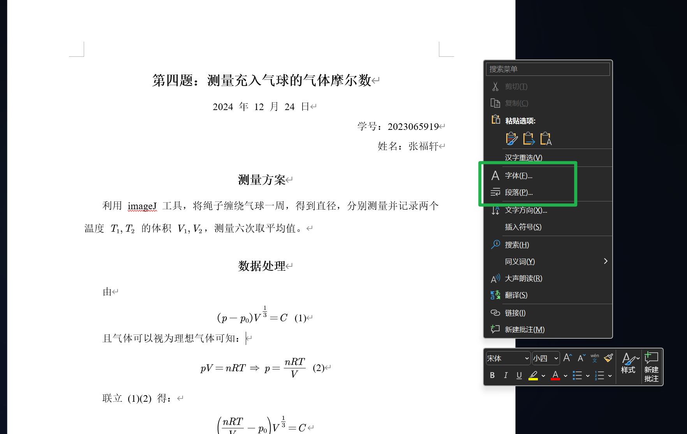

我是怎么知道如何设置的？我连查都没有查，直接鼠标右键就看到了。**遇事不决，先鼠标右键。**

---

#### 模板

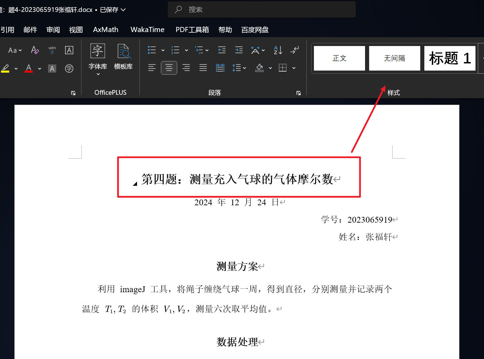

看上面，这个我们可以直接用官方提供好的模板，也可以修改或者创建**自己的模板**，便于**复用**。

怎么修改，**鼠标右键**。

表格等也是有模板的，论文里常用的就是三线表，但每次都手动去画太麻烦，我们需要做一个样式模板。

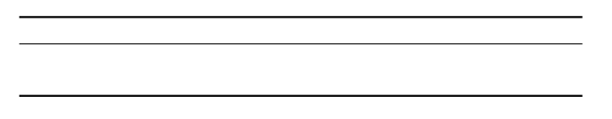

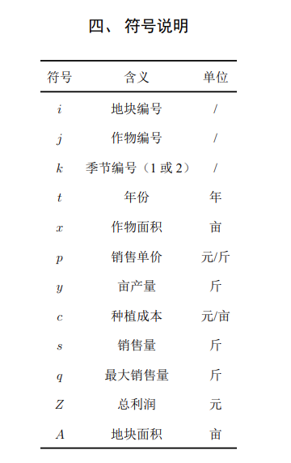

#### 交叉引用

> 交叉引用，就是引用其他地方的文字，比如引用标题、引用表格、引用图片等。例如，如图 `ref{相关内容}` 所示。
>
> 这肯定不能自己写呀，万一你中间插一张图片，顺序就全变了，所以我们要学会交叉引用。

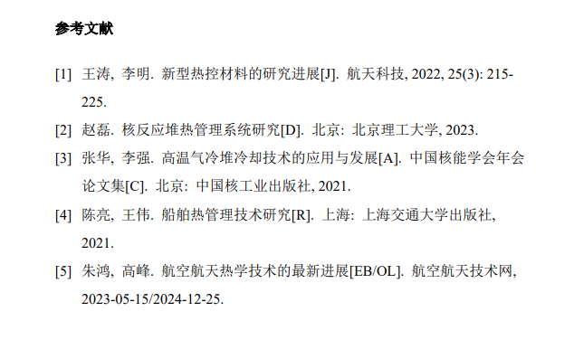

> 图片中参考文献的角标顺序会自动调整，并且，引用的标题会自动更新。

#### 插入图片

> 图片最好居中。

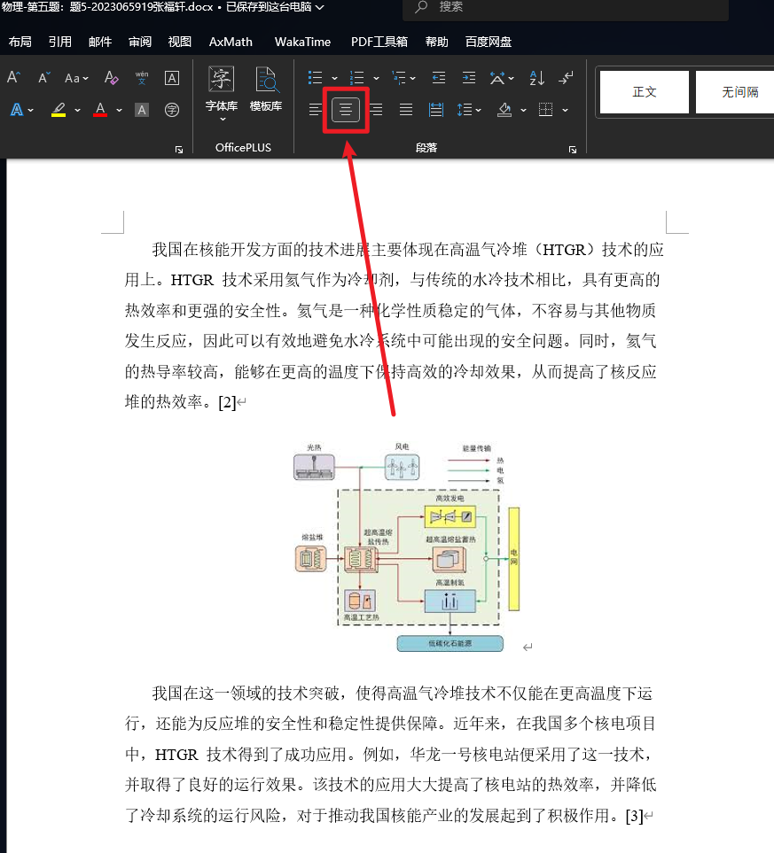

#### 目录与封面

> 目录肯定也不是自己打上去的，而是根据标题自动更新，有新内容，就会生成新目录，只需更新域即可。
>
> 封面也可以插入，同样也有模板。

#### 数学公式

> 最方便的方法就是安装破解版 `AxMath` 插件，可以使用 `LaTeX` 公式语法，否则只用 `Word` 自带的公式编辑器感觉会累死。

#### 效果展示

> 下面是我的报告。

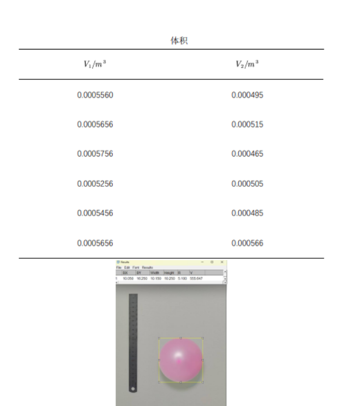

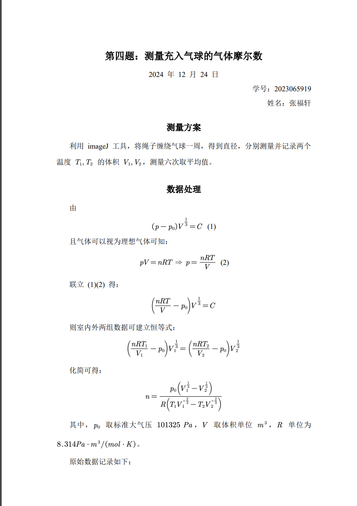

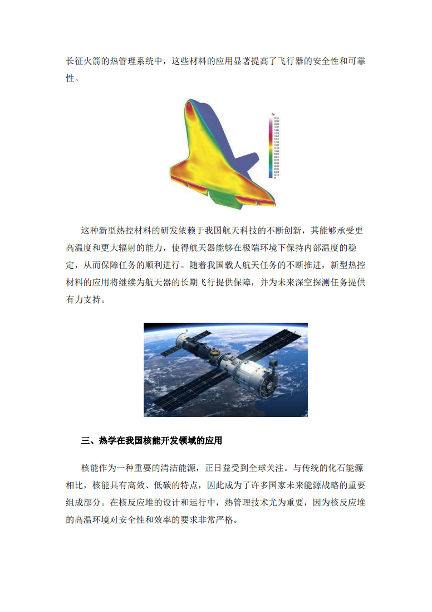

一个图文并茂的报告，应该不需要更多东西了吧。干干净净的排版已成。

---

### Excel

> 如果说 `Word` 的一些工具还需要翻找头部菜单栏，那`Excel` 几乎就是直接鼠标右键再点 `F` 了。
>
> 同样可以做出像教科书一样干净的表格。

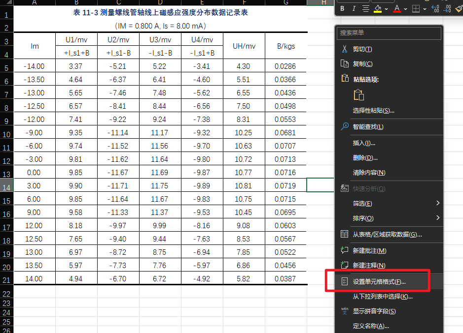

#### 公式计算

> 我常用的是**转置公式** `=TRANSPOSE(array)`，转置表格的行和列，这一点常常用于数据可视化。因为 Excel 做散点图等要求数据按列排，所以有些按行来的数据，我会进行转置。

#### 数据可视化

> 下面这张图的表格样式和我们教材上的一模一样，同时自动计算和数据可视化也很简单。

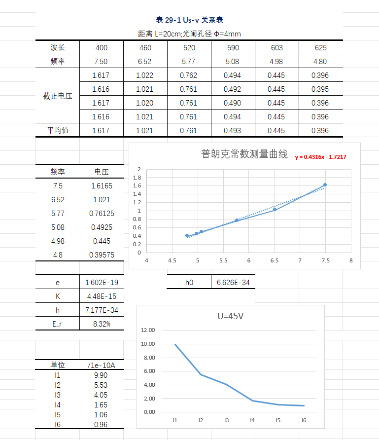

`Excel` 的公式计算和数据可视化，在数据处理中超级方便。

### PPT

#### 动画

> 有的人可以让 `PPT` 放起来就像电影一样，这种进阶难度还是看一下 B 站上的视频吧，太过惊艳了。

#### 板块

> 按照盒子布局来，和网页设计有异曲同工之妙。重点是便于展示。参考平面设计基础。这里我就不提供参考了，你的审美就是最好的参考。

#### 模板

> 咱还是用免费的模板吧，官方就有很多免费的，但是需要注册登录。

#### 细节

> 还有一些小细节，比如内容不能过低，这样讲解时会被头挡住。
>
> 还有内容的放置页码的数量要合理，甚至还要加上结尾 *谢谢观看* 之类的。

#### 自学

> B 站上就有很多优秀的设计教学短视频，每天可以刷一刷，都是五分钟左右的，例如 *旁门左道 PPT*。