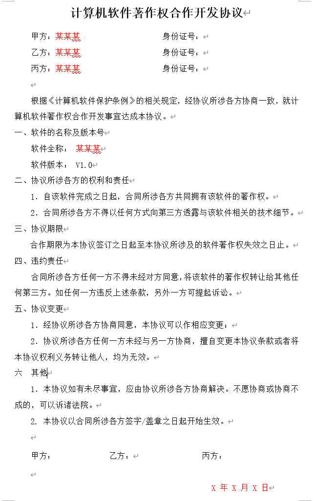
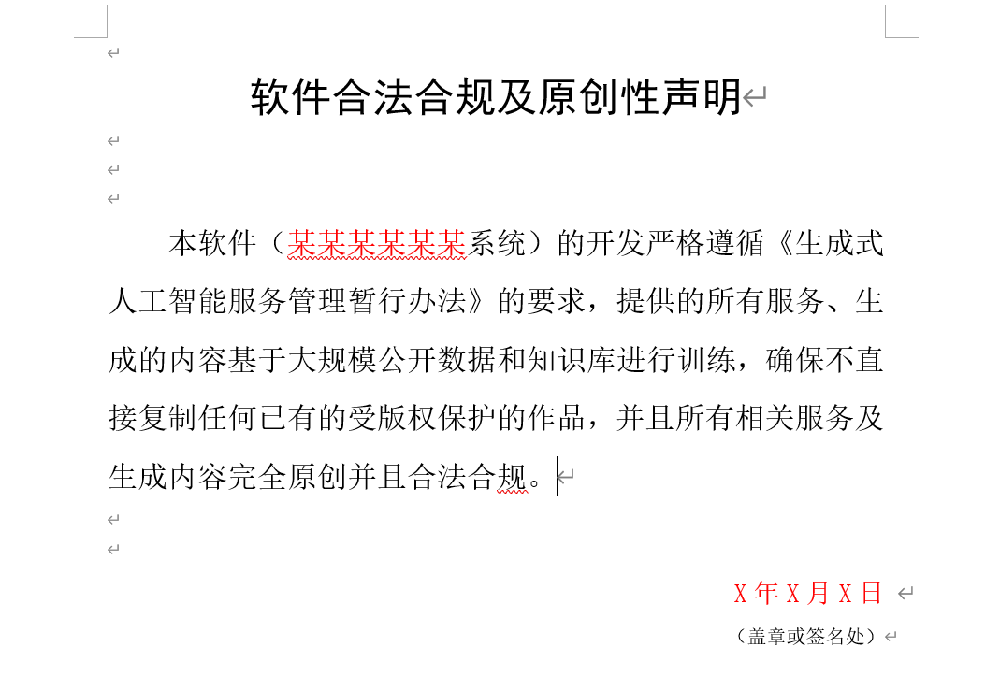
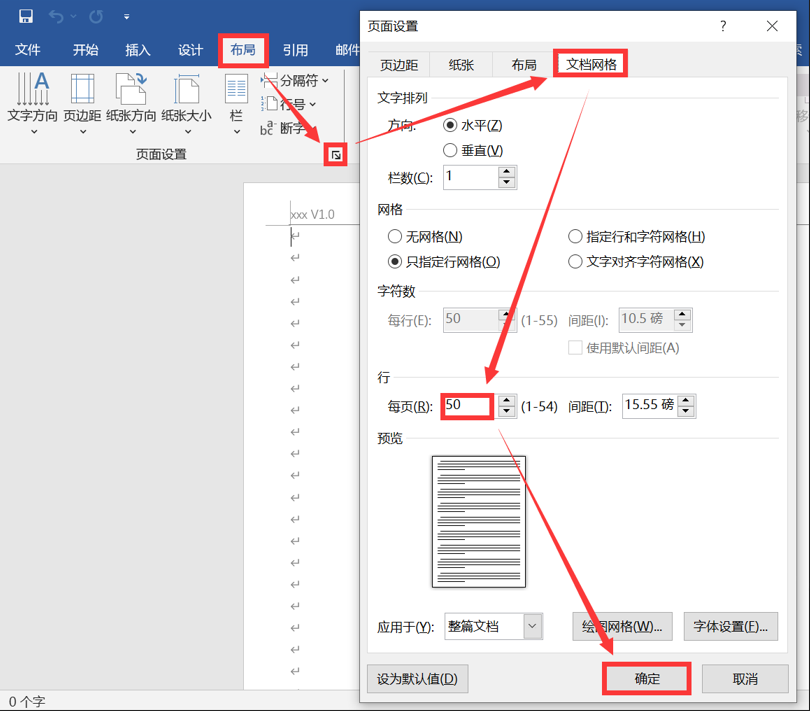
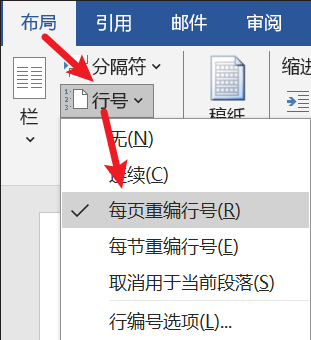
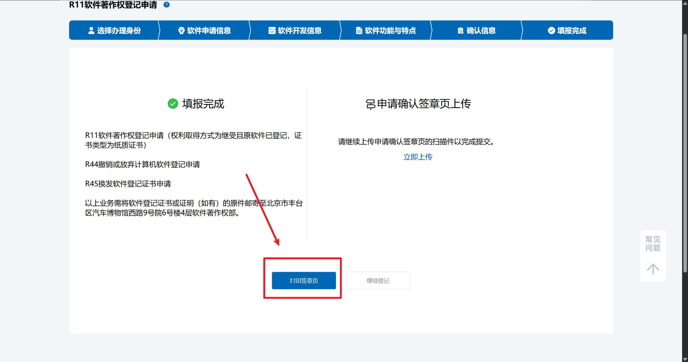
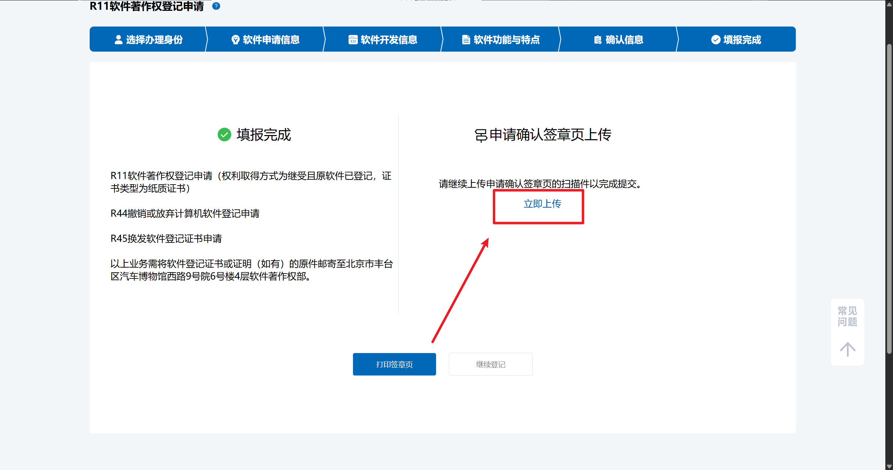

# 前言

我们的目的是为我们的软件申请一份软件著作权。具体的流程是在[中国版权保护中心](https://register.ccopyright.com.cn/query.html)里提交 PDF 申请材料，填写相关信息，然后等待结果。

::: danger
所以在此之前，请先注册账号并完成实名认证信息。这里需要本人与身份证的合影，审核期限约为三天，照片审核很严格，拍不清楚会不通过。
:::

我们的开发流程必须符合开发周期，也就是说开发前的文件的签字日期必须在开发完成前，不可以在同一天，时间周期应该长一些。

下文将假设我们是今年二月签署了材料，在今年三月开发完成提交了申请。中间用了一个月来开发。

# 准备开发阶段

## 第一步：签署合作开发协议

::: warning
如果是个人开发，则本步骤可以跳过。
:::

如果是多人合作开发，准备开发前，需要签署一份合作开发协议。

这里我们需要将红色字迹的地方替换成自己的黑色信息。

注意这里的日期应该是**开发前的日期**，不要写成开发完成的日期，否则会被驳回补正。

甲方、乙方、丙方是**一作、二作、三作**的**手写签名**，如果没有数位板等设备，需要打印下来手写签名，再扫描成电子版的，最后转换为 PDF 文件。



## 第二步：签署软件合法合规及原创性声明

::: warning
如果是不涉及到大模型的调用，则本步骤可以跳过。
:::



在开发前如果软件将会涉及到大模型方面的内容，则需要签署这份声明。注意需要将**系统名**和**日期**更改成准备开发的日期，日期和前面准备开发的日期一样。

打印出来，在签名处前签上所有人的名字，然后重新扫描成 PDF 文件。

# 开发阶段

## 开发系统界面

这里最重要的是界面以及界面所展示出来的**功能**。

界面不一定特别美观，但我们的功能要丰富，这样说明书里才可以多写一些字数。

这里后期我们写操作手册的时候需要把界面的所有功能截图，放到说明书里并描述。

## 整理 60 页 50 行代码

这里需要把代码整理成 60 页，每页 50 行的 Word 文档里，然后转换成 PDF 文件。

需要用到的工具是 VSCode 的插件——软著生成助手。下载后选择对应的文件夹，会将对应的代码保存到一份 TXT 文件里。这里我们需要去掉**中间的多余的代码**，只保留 $60\times 50=3000$ 行，也就是前 30 页和后 30 页。

具体的操作可以问一下 AI。我的操作是用 Vim 打开 TXT 文件，输入 Vim 指令，将中间多余的行删除，只保留开头和结尾的 1500 行，然后保存。

```bash
:1501,$-1500d
```

这行指令的意思是删除第 1501 行到第 23528 行之间的代码。

然后就可以把剩余的 3000 行代码复制到 Word 里了。

需要注意最后一页最后一行必须是完整的代码结尾。不可以是残缺的结构，例如括号没闭合等都不可以。所以代码最好从中间删除，不要从结尾删除。

这里需要注意，Word 里需要在页眉里添加：

- 系统名

- 版本号

- 页码



同时需要在每一行标记**行号**，每页都有 50 行。



最终源码的格式如图：


## 编写操作手册

操作手册需要一张封面，要有目录信息，内容包含系统简介、系统运行环境和系统主要功能。

页数尽量要多于 11 页。

建议的一种内容结构如下：

::: details

- 系统简介

  - 背景

  - 简介

  - 目标用户

  - 主要功能

  - 优势与创新

  - 模型网络结构（放上网络图）

---

- 系统运行环境

  - 系统硬件环境

  - 系统软件环境

  - 模型训练流程（放上流程图）

---

- 系统主要功能

  - 功能一效果展示

  - 功能二效果展示

  - 功能三效果展示

  - 运行界面效果展示

:::

内容写好之后，将其转换为 PDF 格式。

# 提交阶段

## 选择办理身份

1. 登录[中国版权保护中心](https://register.ccopyright.com.cn/query.html)。

2. 点击[版权登记](https://register.ccopyright.com.cn/registration.html#/index)。

3. 选择[计算机软件著作权登记](https://register.ccopyright.com.cn/registration.html#/index)。

4. 点击**立即登记**。

5. 这里选择**我是申请人**。

## 软件申请信息

第一页内容如下：

::: details

- 权利获得方式：`原始所得`。

- 软件全称：建议写成`（基于）xxxx（的）APP/小程序/软件/游戏软件/系统/网站/平台`。

> - 软件简称：

- 版本号：`1.0`

- 权利范围：`全部权利`。

:::

## 软件开发信息

::: details

- 软件分类：`应用软件`

- 软件说明：`原创`

- 开发方式：`合作开发`

  - 上传**计算机软件著作权合作开发协议** PDF 格式。
  - > 这里仅合作开发流程需要

- 是否多个著作权人共同享有软件著作权：`是`

- 开发完成日期：**这个日期是最终的完成日期，注意要比开发协议的日期晚。**

- 发表状态：`未发表`

- 著作权人
  
  - 第一位：默认为申请人不变，点击`添加著作权人`。
  
  - 第二位：填写对应的身份信息。
  
  - 第三位：填写对应的身份信息。

:::

## 软件功能与特点

::: details

- 开发的硬件环境：`13th Gen Intel(R) Core(TM) i5-13500H 2.60 GHz`

- 运行的硬件环境：`13th Gen Intel(R) Core(TM) i5-13500H 2.60 GHz`

- 开发该软件的操作系统：`Windows 11`

- 软件开发环境 / 开发工具：`VSCode`

- 该软件的运行平台 / 操作系统：`Windows、Linux 系统`

- 软件运行支撑环境 / 支持软件：`浏览器`

- 编程语言：`Python、HTML、JavaScript`

- 源程序量：`6300`

- 开发目的：`xxxx`

- 面向领域 / 行业：`xxxx`

- 软件的主要功能：`xxxx`（100 字以上）

- 软件的技术特点：`人工智能软件`，`xxxx`

- 程序鉴别材料：`一般交存`
  - 上传 60 页源码

- 文档鉴别材料：`一般交存`
  - 上传操作手册

- 其他相关证明材料
  - 上传原创性声明（可选）

:::

## 确认信息

向两位申请人发送验证码，确认信息无误后，点击**提交**。

## 上传签章页



打印出来，在签名处前签上**申请人**的名字，然后重新扫描成 PDF 文件。

点击`立即上传`。



点击`上传签章页`，点击`确认提交`。

::: tip
之后需要定期检查申请状态，如果需要补正，按照提示进行补正即可。

如果补正的次数过多，可以放弃原先的重新申请一份。
:::
