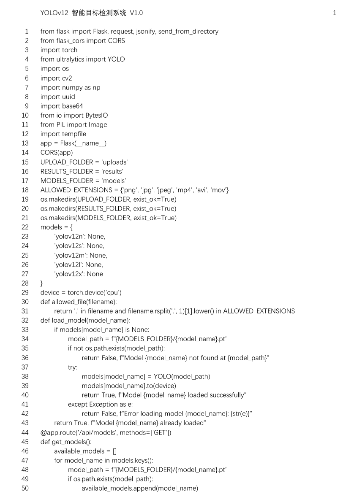

# 前言

我们的目的是为我们的软件申请一份软件著作权。具体的流程是在[中国版权保护中心](https://register.ccopyright.com.cn/query.html)里提交 PDF 申请材料，填写相关信息，然后等待结果。

::: danger
所以在此之前，请先注册账号并完成实名认证信息。这里需要本人与身份证的合影，审核期限约为三天，照片审核很严格，拍不清楚会不通过。
:::

我们的开发流程必须符合开发周期，也就是说开发前的文件的签字日期必须在开发完成前，不可以在同一天，时间周期应该长一些。

下文将假设我们是今年二月签署了材料，在今年三月开发完成提交了申请。中间用了一个月来开发。

# 准备开发阶段

## 第一步：签署合作开发协议

::: warning
如果是个人开发，则本步骤可以跳过。
:::

如果是多人合作开发，准备开发前，需要签署一份合作开发协议。

这里我们需要将红色字迹的地方替换成自己的黑色信息。

注意这里的日期应该是**开发前的日期**，不要写成开发完成的日期，否则会被驳回补正。

甲方、乙方、丙方是**一作、二作、三作**的**手写签名**，如果没有数位板等设备，需要打印下来手写签名，再扫描成电子版的，最后转换为 PDF 文件。


## 第二步：签署软件合法合规及原创性声明

::: warning
如果是不涉及到大模型的调用，则本步骤可以跳过。
:::


在开发前如果软件将会涉及到大模型方面的内容，则需要签署这份声明。注意需要将**系统名**和**日期**更改成准备开发的日期，日期和前面准备开发的日期一样。

打印出来，在签名处前签上所有人的名字，然后重新扫描成 PDF 文件。

# 开发阶段

## 开发系统界面

这里最重要的是界面以及界面所展示出来的**功能**。

界面不一定特别美观，但我们的功能要丰富，这样说明书里才可以多写一些字数。

这里后期我们写操作手册的时候需要把界面的所有功能截图，放到说明书里并描述。

## 整理 60 页 50 行代码

这里需要把代码整理成 60 页，每页 50 行的 Word 文档里，然后转换成 PDF 文件。

需要用到的工具是 VSCode 的插件——软著生成助手。下载后选择对应的文件夹，会将对应的代码保存到一份 TXT 文件里。这里我们需要去掉**中间的多余的代码**，只保留 $60\times 50=3000$ 行，也就是前 30 页和后 30 页。

具体的操作可以问一下 AI。我的操作是用 Vim 打开 TXT 文件，输入 Vim 指令，将中间多余的行删除，只保留开头和结尾的 1500 行，然后保存。

```bash
:1501,+23528d
```

这行指令的意思是删除第 1501 行到第 23528 行之间的代码。

然后就可以把剩余的 3000 行代码复制到 Word 里了。

需要注意最后一页最后一行必须是完整的代码结尾。不可以是残缺的结构，例如括号没闭合等都不可以。所以代码最好从中间删除，不要从结尾删除。

这里需要注意，Word 里需要在页眉里添加：

- 系统名

- 版本号

- 页码


同时需要在每一行标记**行号**，每页都有 50 行。


最终源码的格式如图：



## 编写操作手册

操作手册需要一张封面，要有目录信息，内容包含系统简介、系统运行环境和系统主要功能。

页数尽量要多于 11 页。

建议的内容结构是：

- 系统简介

  - 背景

  - 简介

  - 目标用户

  - 主要功能

  - 优势与创新

  - 模型网络结构（放上网络图）

- 系统运行环境

  - 系统硬件环境

  - 系统软件环境

  - 模型训练流程（放上流程图）

- 系统主要功能

  - 功能一效果展示

  - 功能二效果展示

  - 功能三效果展示

  - 运行界面效果展示

内容写好之后，将其转换为 PDF 格式。

# 提交阶段

## 填写申请表

登录[中国版权保护中心](https://register.ccopyright.com.cn/query.html)，点击[版权登记](https://register.ccopyright.com.cn/registration.html#/index)，选择[计算机软件著作权登记](https://register.ccopyright.com.cn/registration.html#/index)，点击**立即登记**。

这里选择**我是申请人**。

- 权利获得方式：原始所得。

- 软件全称：建议写成 （基于）xxxx（的）APP/小程序/软件/游戏软件/系统/网站/平台

> - 软件简称：

- 版本号：1.0

- 权利范围：全部权利。

下一步。

- 软件分类：应用软件

- 软件说明：原创

- 开发方式：合作开发

  - 上传**计算机软件著作权合作开发协议** PDF 格式。

- 是否多个著作权人共同享有软件著作权：是

- 开发完成日期：这个日期是最终的完成日期，注意要比开发协议的日期晚。

- 发表状态：未发表

- 著作权人
  
  - 第一位
  
  - 第二位
  
  - 第三位

```txt
【办理身份】

我是申请人

----------

【软件全称】Tip：建议写成 （基于）xxxx（的）APP/小程序/软件/游戏软件/系统/网站/平台

“运动荟”赛事管理——基于Spring Boot和小程序的赛事管理系统

【版本号】Tip：建议填写 V1.0 或 V1.0.0

V1.0

----------

【软件分类】Tip：自行选择

应用软件

【开发方式】Tip：一般都是 单独开发 or 合作开发

单独开发

【开发完成日期】Tip：若为合作开发，合作开发协议上的日期，要早于这里数月

2023年3月12日

【著作权人】Tip：单独开发不用管；若为合作开发，自行添加和调整顺序

----------

【开发的硬件环境】TIP：不超过50字符

Windows 10系统的笔记本电脑

【运行的硬件环境】TIP：不超过50字符

iOS、Android系统的手机和平板

【开发该软件的操作系统】TIP：不超过50字符

Windows 10

【软件开发环境 / 开发工具】TIP：不超过50字符

MyEclipse、微信开发者工具 和 Navicat Premium

【该软件的运行平台 / 操作系统】TIP：不超过50字符

iOS、Android

【软件运行支撑环境 / 支持软件】TIP：不超过50字符

微信平台

【编程语言】TIP：不超过120字符

Java、HTML、JavaScript、SQL

【源程序量】TIP：你可以算上or不算上注释的行数，这个不要紧

5682

【开发目的】TIP：8~50字符

让运动赛事管理更加高效、快速和规范，从而降低管理成本

【面向领域 / 行业】TIP：4~50字符

赛事管理

【软件的主要功能】TIP：100~200字符

用户可以进行注册登录、查看运动场馆、查看赛事信息、修改个人信息、进行意见反馈等操作。 管理员可以进行管理用户、管理场馆类型、管理运动场馆、场馆预约、管理赛事信息、管理赛事报名、查看意见反馈、系统管理等操作。

【软件的技术特点】TIP：不超过100字符

小程序
使用了Spring Boot框架，简化了项目的搭建和开发过程
```

## 上传签章页

填写完申请表并提交之后，需要上传签章页。签章页需要打印出来，不过不用盖章，签字即可，然后扫描成 PDF 文件，重新提交。
