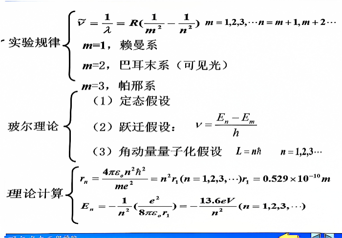

## 磁场

**毕奥-萨德尔定律:**

$$
d\vec B=\frac {\mu_0}{4\pi}\frac{Id\vec l\times\vec r}{r^3}
$$

> 1. 各类形状导线：利用公式组合计算
> 2. 场无对称：积分计算
> 3. 运动电荷：$dI=\tfrac{dq}{T}$ 再积分

**安培环路定理：**

> 场有对称：看是否有磁介质
>
> $\vec B=\mu\vec H=\mu_0\mu_r\vec H$

$$
\oint_L \vec B\cdot d\vec l=\mu_0\sum_iI_i
$$
$$
\oint_L \vec H\cdot d\vec l=\sum_iI_i
$$

**磁通量：**

> 一般只考长直导线磁场穿过三角形或矩形线框

**安培力：**

> 如遇圆或球，将线量转化为角量

### **磁力矩**

- 均匀：$\vec{P_m}=I_S\vec{e_r},\,\vec{M}=\vec{P_m}\times\vec{B}$
- 不均匀：$\vec{M}=\vec{r}\times\vec{F}$
  - 太难的不会考

### **霍尔效应**

> 需要记住推理过程，不要死记硬背。
>
> 考试必考。

$$
qE_H=qvB \to E_H=vB
$$
$$
U_H=E_H\cdot d \to U_H=vBd
$$
$$
I=qnSv=Iqnad \to v=\frac{I}{qnad}
$$
$$
U_H=\frac{IB}{nqa}
$$

**功：**

### **磁场强度**

$$
\vec B=\mu\vec H=\mu_0\mu_r\vec H
$$
$$
\vec M=\frac{\vec B}{\mu_0}-\vec{H}
$$
$$
\vec M=\dot J_S
$$

|    结论     |    顺磁质    |    抗磁质    | 铁磁质 |
| :-------: | :-------: | :-------: | :-: |
| 分子电流与传导电流 |   方向相同    |   方向相反    |     |
|    磁导率    | $\mu_r>1$ | $\mu_r<1$ |     |
|    磁化率    |  $x_m>0$  |  $x_m<0$  |     |

### **电动势**

> 动生电动势
>
> - 法拉第电磁感应定律
>
> - 动生公式
>
> 感生电动势
>
> - 对感生电场求积分
>
> - 法拉第电磁感应定律
>

> 积分时为防止 $M$ 变化，建议写在积分变量里：
>
> $$\varepsilon_{21}=\frac{d(MI_1)}{dt}$$
>
> 自感/互感系数考选择填空题

### **磁场的能量**

能量密度

$$
\omega_m=\frac{1}{2}BH
$$

能量

$$
W_m=\int \omega_m dV=\frac{1}{2}\int BH dV
$$

### **位移电流**

> 变化的电场等效的电流

位移电流

$$I_D=\frac{d}{dt}\int \vec D\cdot d\vec S$$

位移电流密度

$$
\vec J_D=\frac{\partial \vec D}{\partial t}
$$

- 求 $\vec{J_D}$ 方向：就是电位移矢量变化的方向，是垂直于黑板向外
- $\vec{B}$ 方向：由右手螺旋定则确定

### **麦克斯韦方程组**

## 热力学

**记住三个公式：**

$$
p=\frac 2 3 n \vec \varepsilon_k
$$

$$
p= n k T
$$

$$
pV=\frac M {M_{mol}} RT
$$

由前两个式子可推出，

$$
\vec \varepsilon_k=\frac 3 2 k T
$$

**麦克斯韦速率分布：**

> 只需要记下面的式子

在 $v\sim v+dv$ 下，

$$
\frac{dN}{N}=f(v)dv
$$

已知 $f(v)$，

### 分子数

$$
\int_{v1}^{v2}Nf(v)dv
$$

### 百分比

$$
\int_{v1}^{v2}f(v)dv
$$

### 平均速率

$$
\int_{0}^{\infty}vf(v)dv
$$

若是 $v_1 \sim v_2$ 下，

$$
\overline v =\frac{\int_{v1}^{v2}vf(v)dv}{\int_{v1}^{v2}f(v)dv}
$$

### 方均速率

$$
\overline {v^2}=\int_0^{\infty}v^2f(v)dv
$$

**三种速率：**

**热力学第一定律：**

开氏温度 **$-273.15\text {℃}=0K$**。

**热力学第二定律：**

>两个表述和熵增原理。

## 狭义相对论

## 量子力学

> 光电效应的四条结论记住
>
> 补充一个公式：
>
> $$eU_0=\frac 1 2 m v^2$$
>
> 康普顿散射
>
> - 公式
>
> - 解释模型
>
>   - 动量守恒
>
>   - 能量守恒
>
> - 求光子的运动质量

> 两步
>
> 1. $$\lambda = \frac h {mv}$$
>
> 2. $$eU=\frac{1}{2}mv^2=\frac {p^2}{2m}$$

> 要知道前四个谱系
>
> $$r_n=n^2r_1$$
>
> $$E_1=-13.6eV$$
>
> $$E_n=\frac{E_1}{n^2}$$

> 薛定谔方程不考

> 这一页要背

