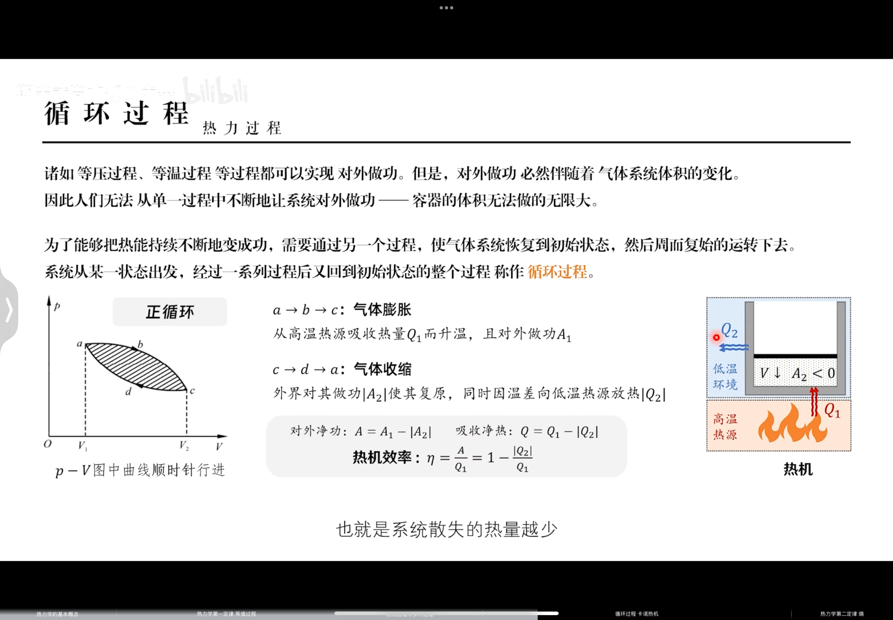
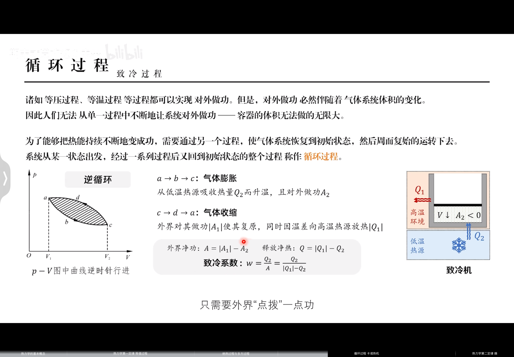
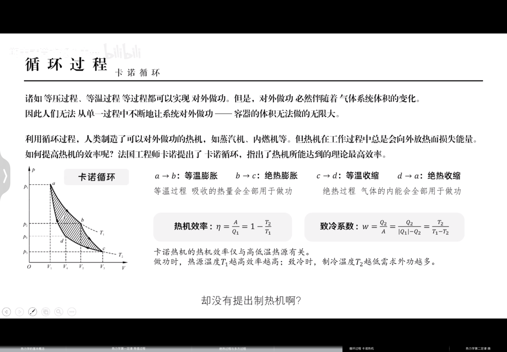

- 内能：$E=\tfrac{m}{M}\tfrac{i}{2}RT\,$  气体内部所具有的量，是**状态量**（即只与物体所处的状态有关）。

- 功：$A=\int_{v_1}^{v_2}pdV\,$  气体从一种状态到另一种状态，系统对外所做的功（有正负之分）。

- 热量：$Q=\frac{m}{M}C_m(T_2-T_1)\,$ 气体系统与外界间由于有温差而传递的能量，是过程量。

- 摩尔热容：$C_m\,$ **$1mol$** 的物质。

## 热力学第一定律

$$
Q=\Delta E+A
$$
>系统从外界吸收的热量，一部分增加了气体的内能，一部分用于外界做功。

| 过程  |       特征        |       过程方程        |             W              |    $\Delta E$    |        Q         |         气体摩尔热容量         |
| :-: | :-------------: | :---------------: | :------------------------: | :--------------: | :--------------: | :---------------------: |
| 等体  | $V=C$ $W=0$  | $\tfrac p T = C$ |           $0$            | $vC_V\Delta T$ |  $=\Delta E$   |   $C_V=\frac i 2 R$   |
| 等压  |     $p=C$     | $\tfrac V T = C$ |       $vR\Delta T$       | $vC_V\Delta T$ | $vC_p\Delta T$ | $C_p=\frac i 2 R + R$ |
| 等温  | $T=C$ $dE=0$ |     $pV=C$      | $vRT\ln \tfrac{V_2}{V_1}$ |      $0$       |      $=W$      |    $C_T\to\infty$     |
| 绝热  |    $dQ=0$     |  $pV^\gamma=C$  |     $-cC_V\Delta T$      | $cC_V\Delta T$ |      $0$       |        $C_a=0$        |

### 等体过程

$V$ 恒定，$dV=0$

- 过程方程：$pT^{-1}=\text{常值}$

- 对外做功：$A=0$

- 内能变化：$\Delta E=\tfrac{m}{M}\tfrac{i}{2}R(T_2-T_1)$

- 吸收热量：$Q=\frac m M C_V(T_2-T_1)$

- 由 $Q=\Delta E+A$ 可知，定体摩尔热容：$C_V=\frac i 2 R$

### 等压过程

$p$ 恒定，$dp=0$

- 过程方程：$VT^{-1}=\text{常值}$

- 对外做功：$A=p(V_2-V_1)$

- 内能变化：$\Delta E=\tfrac{m}{M}\tfrac{i}{2}R(T_2-T_1)$

- 吸收热量：$Q=\frac m M C_p(T_2-T_1)$

- 由 $Q=\Delta E+A$ 可知，定压摩尔热容：$C_p=\frac i 2 R+R$

>迈耶公式：$C_p=C_V+R$
>
>比热容比：$\gamma =\tfrac {C_p}{C_V}=\tfrac {2+i}{i}$

### 等温过程

$T$ 恒定，$dT=0$

- 过程方程：$pV=\text{常值}$

- 对外做功：$A=\tfrac {m}{M}RT\ln \tfrac{V_2}{V_1} (\tfrac{p_2}{p_1})$

- 内能变化：$\Delta E=0$

- 吸收热量：$Q=A$

- 由 $T_2-T_1=0$ 可知，定温摩尔热容：$C_T=\infty$

>是理想的，现实中很难实现。

### 绝热过程

无热量交换 $dQ=0$

- 过程方程：$pV^\gamma=\text{常值}$（$\gamma$ 是比热容比）

- 对外做功：$A=\tfrac {p_1V_1-p_2V_2}{\gamma-1}=-\Delta E$

- 内能变化：$\Delta E=\frac{m}{M}\frac{i}{2}R(T_2-T_1)$

- 吸收热量：$Q=0$

- 比值：$\frac{T_2}{T_1}=(\frac{V_1}{V_2})^{\gamma-1}$

>是理想的，现实中很难实现。

### 多方过程

>介于**等值过程**与**绝热过程**之间的过程，$n$ 为多方指数。

- 过程方程：$pV^n=\text{常值}$

|    n     |     常值      |  过程  |
| :------: | :---------: | :--: |
|    0     |     $p$     | 等压过程 |
|    1     |    $pV$     | 等温过程 |
| $\gamma$ | $pV^\gamma$ | 绝热过程 |
| $\infty$ |     $V$     | 等体过程 |

## 循环过程

### 热力循环

### 制冷循环

>热泵效率和制冷效率同理。

### 卡诺循环

## 热力学第二定律

>自然界一切宏观热现象具有方向性。

**开尔文表述：**

不可能从单一热源吸收热量，使之完全变为功而不产生其他影响。

>指出了**功热效应**的不可逆性。功可以自发的变为热，但热不可能自发的全部变为功。

**克劳修斯表述：**

热量不能自动的从低温物体传向高温物体。

>指出了**热传导过程**的不可逆性。热量可以自发地由高温物体传向低温物体，反之则不可以。

### 热力学概率 $\Omega$

>某宏观太所包含的微观态总数目。它的取值可以远大于 1。
>
>是系统无序性的一种量度。

## 熵

**玻尔兹曼熵：**

$$
S=k\ln \Omega
$$
>$k=1.38\times10^{-23}J/K$：玻尔兹曼系数；
>
>$\Omega$：热力学概率；
>
>熵是状态量，仅取决于系统所属的状态。

**克劳修斯熵：**
$$
\Delta S = \int_1^2\frac{dQ}{T}
$$
>$dQ$：无限小过程中，系统吸收的热量；
>
>$T$：上述过程发生时的系统温度；
>
>此式仅能计算可逆过程的熵变，但是熵变本身与过程无关。

**熵增加原理：**

>**孤立系统**的熵永远不可能减少。也就是 $dS\ge 0$ 恒成立。
>
>- 当 $dS>0$ 时，系统进行不可逆过程。
>
>- 当 $dS=0$ 时，系统进行**可逆过程**。
