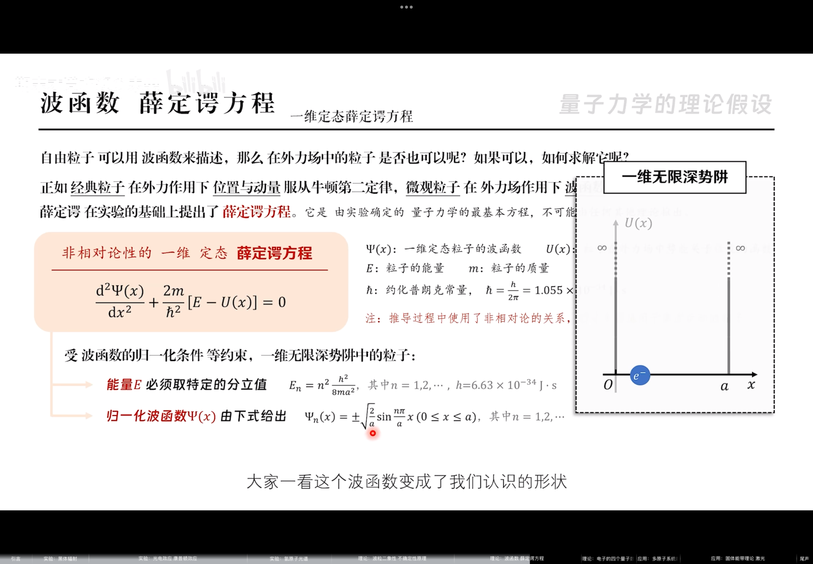

## 黑体辐射

**斯特藩-玻尔兹曼定律：**

> 黑体的总辐出度仅与温度有关，与温度的四次方成正比。

$$
M_B(T)=\sigma T^4
$$

**维恩位移定律：**

> 单色辐出度取峰值的波长仅与温度有关，温度升高，峰值波长向右移动。

$$
T\lambda_M=b
$$

**能量量子化：**

$$
\varepsilon = hv
$$

## 光电效应

**光子能量：**

$$
\varepsilon =hv
$$

**光子质量：**

$$
m= \frac \varepsilon {c^2}=\frac{hv}{c^2}
$$

**光子动量：**

$$
p=mc=\frac{hv}{c}=\frac{h}{\lambda}
$$

**光电效应方程：**

$$
hv=\frac 1 2 mv_m^2+A
$$

$$
A=hv_0
$$

> 红线频率就是截止频率；红线波长就是截止波长

**康普顿散射公式：**

$$
\Delta\lambda=\frac{2h}{m_0c}\sin^2{\frac \varphi 2}
$$

## 氢原子光谱

> 基态能级能量 $E_1=-13.6eV$

$$
\tilde{v}=\frac 1 \lambda = R(\frac{1}{n^2}-\frac 1 {m^2})
$$

## 实物粒子

**德布罗意关系：**

- 光子能量：$E=mc^2=hv$
- 光子动量：$p= m v = \frac {h\upsilon} v=\frac h \lambda$

物质波表示了一种**概率波**

## 海森堡不确定性原理

## 波函数与薛定谔方程

## 原子中电子的四个量子数

> “磁”是磁矩方向的意思

|     |      主量子数       |                    角量子数                    |                     磁量子数                     |                        自旋量子数                        |
| :-: | :-------------: | :----------------------------------------: | :------------------------------------------: | :-------------------------------------------------: |
| 含义  |  **主要**决定电子的能量  |                决定电子的绕核旋转角动量                |                决定电子的绕核角动量空间去向                |                   决定电子的自旋角动量空间去向                    |
| 取值  | $n=1,2,3,\dots$ | $l=0,1,2,\dots,n-1$处于 n 能级的电子有 n 种可能的角动量 | $m=0,\pm 1,\pm2,\dots,\pm l$分量可正克负，且不大于角动量 | $m_s=\pm \frac 1 2$自旋角动量$S=\frac {\sqrt 3}{2}h$ |

> **口诀：**

- 主量子数$n$ 定能量，比零大整数 任选
- 角量子数 $l$ 定旋转，小于主量零 也可
- 磁量子数 $m_l$ 定取向，不超角量 可正负
- 自旋磁量子 $m_s$ 特殊，只取正负 $\tfrac 1 2$

## 原子的壳层结构

## 固体的能带理论

好多内容呀，快听不懂了

## 激光

