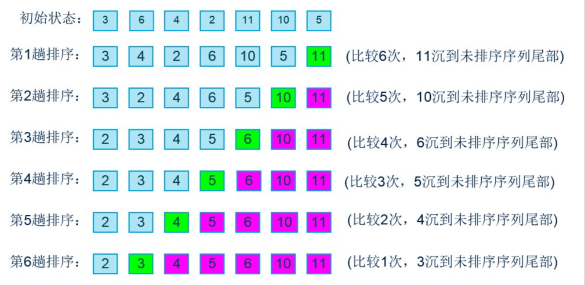

:::tip
给你一个数字数组 `arr` 。

如果一个数列中，任意相邻两项的差总等于同一个常数，那么这个数列就称为 **等差数列** 。

如果可以重新排列数组形成等差数列，请返回 `true` ；否则，返回 `false` 。
:::

冒泡循环改了三次才改出来，在接近笨蛋。



<<< ./code/1502.c

我认为我应该记住 `C++` 里的 `sort` 函数，希望考场里不会忘记 `algorithm` 单词的拼写。

:::details

```cpp
sort(first_pointer, first_pointer + n, cmp);
```

此函数有3个参数：

- 参数1：第一个参数是数组的首地址，一般写上数组名就可以，因为数组名是一个指针常量。

- 参数2：第二个参数相对较好理解，即首地址加上数组的长度n（代表尾地址的下一地址）。

- 参数3：默认可以不填，如果不填 `sort` 会默认按数组升序排序。也就是 1,2,3,4 排序。也可以自定义一个排序函数，改排序方式为降序什么的，也就是 4,3,2,1 这样。

**使用需要**：

```cpp
#include <algorithm>
using namespace std;
// ···
sort(A, A + n); // 对数组 A 进行排序，n 为 A 的长度
```

:::

<<< ./code/1502.cpp
