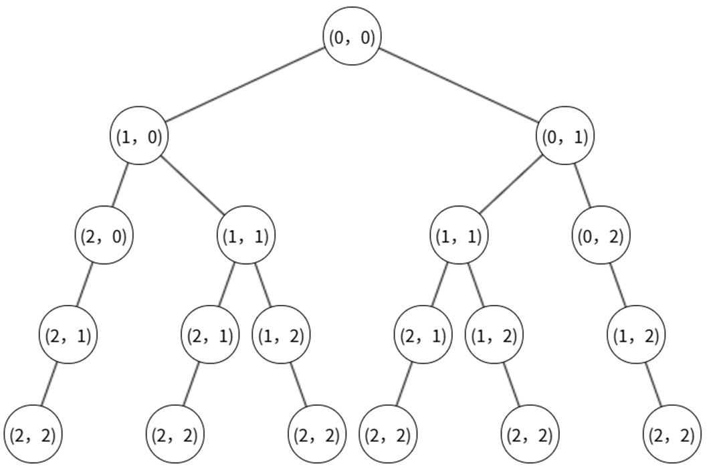
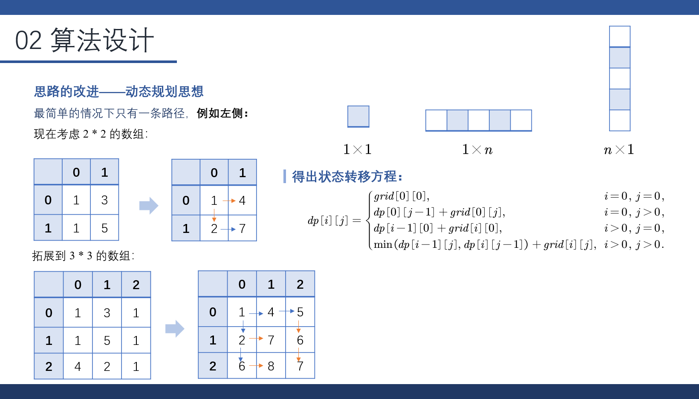

::: tip
给定一个包含非负整数的 `_m_ x _n_` 网格 `grid` ，请找出一条从左上角到右下角的路径，使得路径上的数字总和为最小。

说明：**每次只能向下或者向右移动一步。**
:::

这道题目中，最容易想到的方法就是遍历所有路径情况。由于每次只能向下或者向右移动一步，所以每个单元格都有两种选择。那么时间复杂度自然就是 $O(2^n)$，太高了。



因此，我们需要对算法进行改进。

## 算法设计

### 最简单的情况

最简单的情况那就是只有一条路径。要么一行 n 列，要么 n 行一列，或是 1 行 1 列。

所以在这种情况下，路径是唯一选择了。

### 多行多列的情况

而如果是多行多列的呢？既然上一个方块只能向右或是向下走，那么反过来，下面的方块是不是也要么来自于上面，要么来自于右面呢？

而为了最短的路径，我们只需要选取这两条路径中最小的一条就可以了。

那怎么判断哪两条路径最小呢？我们在设计的时候，可以考虑把前面的路径总长度加在当前的方格里累加。那么最终，方程就是这样的了。



$$
dp\left[ i \right] \left[ j \right] =\begin{cases}
	grid\left[ 0 \right] \left[ 0 \right] ,&		i=0,\,\,j=0,\\
	dp\left[ 0 \right] \left[ j-1 \right] +grid\left[ 0 \right] \left[ j \right] ,&		i=0,\,\,j>0,\\
	dp\left[ i-1 \right] \left[ 0 \right] +grid\left[ i \right] \left[ 0 \right] ,&		i>0,\,\,j=0,\\
	\min \bigl( dp\left[ i-1 \right] \left[ j \right] ,\,dp\left[ i \right] \left[ j-1 \right] \bigr) +grid\left[ i \right] \left[ j \right] ,&		i>0,\,\,j>0.\\
\end{cases}
$$

```c
int min(int a, int b) {
    return a < b ? a : b;
}
  
int minPathSum(int** grid, int gridSize, int* gridColSize) {
    int m = gridSize;
    if (m == 0) return 0;
    int n = gridColSize[0];
    if (n == 0) return 0;
    
    // 分配 dp 数组
    int** dp = (int**)malloc(m * sizeof(int*));
    for (int i = 0; i < m; i++) {
        dp[i] = (int*)malloc(n * sizeof(int));
    }

    // 初始化起点
    dp[0][0] = grid[0][0];

    // 第一行只能从左边累加
    for (int j = 1; j < n; j++) {
        dp[0][j] = dp[0][j - 1] + grid[0][j];
    }

    // 第一列只能从上面累加
    for (int i = 1; i < m; i++) {
        dp[i][0] = dp[i - 1][0] + grid[i][0];
    }

    // 填表：每个位置只能从上方或左方来，取最小值
    for (int i = 1; i < m; i++) {
        for (int j = 1; j < n; j++) {
            dp[i][j] = min(dp[i - 1][j], dp[i][j - 1]) + grid[i][j];
        }
    }

    int result = dp[m - 1][n - 1];
  
    // 释放内存
    for (int i = 0; i < m; i++) {
        free(dp[i]);
    }
    
    free(dp);
    return result;

}
```

