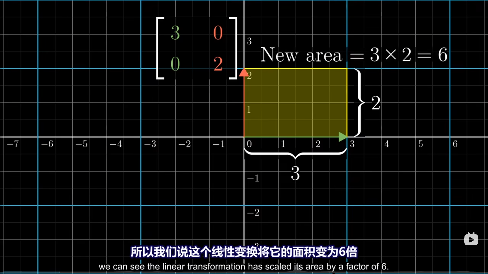

# 行列式

::: tip
> The `determinant` of a transformation

是描述线性变换将原有面积压缩或放大的比例。
:::

> 如图，初始面积是 1，经过线性变换后，面积是 6。

::: tip
如果行列式的面积为 0，则线性变换将原有图形压缩到一条线上了。
:::

## 如果结果为负数呢？

- 负数的面积，意味着这样的变换改变了空间的定向，相当于把空间翻转了。

- 同样也可以理解为将 $\hat{i}$ 和 $\hat{j}$ 交换了顺序。原本 $\hat{i}$ 在 $\hat{j}$ 的左边，变换后 $\hat{i}$ 在 $\hat{j}$ 的右边。

## 三维空间

行列式在三维空间里则描述的是线性变换的体积了。

如果行列式为 0，那么这意味着变换到了一个平面或是一条直线甚至是一个点。那这也可以说明，矩阵的列必然线性相关了。

如果行列式为负，运用右手定则就可以发现，空间被翻转了。

$$
det(M_1M_2) = det(M_1)det(M_2)
$$
