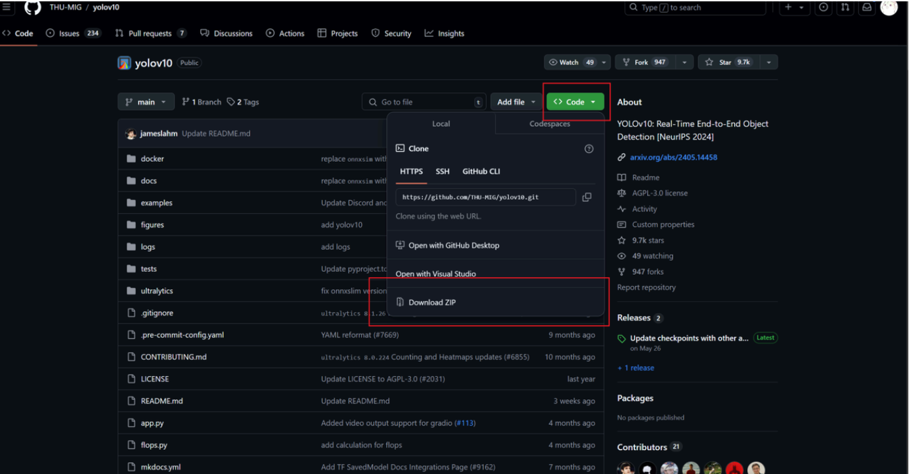

# Anaconda 安装和使用及调用 YOLOv10 模型实现物品目标检测

## 目标

> 我们想要目标检测一个物体，并识别它的类别。

## 算法

:::tip
YOLOv10 是清华大学研究人员近期提出的一种实时目标检测方法，我们将基于它来实现。
:::

## 配置环境

> 进入 GitHub 仓库查看其开源代码及环境配置，我们发现想要运行代码，不仅需要 python 3.9 的版本，还要安装众多指定版本的第三方库：

```python
torch==2.0.1
torchvision==0.15.2
onnx==1.14.0
onnxruntime==1.15.1
pycocotools==2.0.7
PyYAML==6.0.1
scipy==1.13.0
onnxslim==0.1.31
onnxruntime-gpu==1.18.0
gradio==4.31.5
opencv-python==4.9.0.80
psutil==5.9.8
py-cpuinfo==9.0.0
huggingface-hub==0.23.2
safetensors==0.4.3
```

因此，我们需要安装 Python 3.9 以及上面所提及的第三方库，版本一定要完全对应。

但是，可能有一些人事先安装好了 Python，甚至装过上面的第三方库，可是**版本**与代码所需版本不匹配，甚至还会有**冲突**。为了避免因版本不一致导致的各种潜在环境，我们选择使用 **Anaconda** 来创建一个 python 3.9 的虚拟环境，并安装所需的第三方库。

## **Anaconda 的下载、安装与虚拟环境的创建、激活**

建议：把之前安装的 python 卸载掉。

### **下载 Anaconda**

这是国内清华大学提供的 Anaconda 镜像站，无需使用梯子，请关闭代理再进行下载。[Anaconda 64 位下载地址](https://mirror.tuna.tsinghua.edu.cn/anaconda/archive/Anaconda3-5.3.1-Windows-x86_64.exe)

### **安装 Anaconda**

选择为所有用户安装，并选择自定义安装路径。


安装路径请选择到系统的根目录，如 D 盘，如下图，这样方便我们进行环境变量的配置。


安装过程中，出现 Advanced options 选项:

第一个选项是自动配置到系统的环境变量中，虽然它很方便，但如果我们后期想要对其进行**卸载与重装**，就会特别麻烦，所以我们先不选，一会二我们手动配置。


进度条走完之后:


### **配置环境变量**

在配置之前，请一定要观看这个视频，了解一下什么是环境变量。


把这几条复制到系统环境变量里面（注意我的安装路径是 `D:\Anaconda` 这个目录，请根据自己实际安装目录进行改动，比如装在 C 盘根目录，就把所有 D 改成 C 就可以的）：

打开终端，输入 `conda --version`，如果出现版本号，说明环境变量配置成功。

### **创建与激活虚拟环境**

下载好之后，电脑里会有这个文件夹：


打开它，然后打开 Anaconda Prompt，输入以下命令：

`conda` 是我们刚刚下载好的软件，`create` 是创建的意思，`-n` 代表 `name` 命名，后面跟着的就是我们给这个环境起的名字，因为我们要跑的代码就是 yolov10 模型，所以为了好记，我们就把这个环境也命名为 yolov10，`python=3.9` 就是代表着我们创建的环境中的 python 版本为 3.9。


所以上面这条命令的意思是创建一个名为 yolov10 的虚拟环境，并指定 python 版本为 3.9。

中间会提示你是否创建，请输入 `y`，然后回车。

创建好之后，输入以下命令激活进入这个虚拟环境：

进入 yolov10 环境后，前面的括号会变成你的环境名，请不要关闭这个黑框框，因为后期我们还会用到。


此时，我们就可以开始配置我们的代码运行环境了。

如果上面有报错，可能是网络问题，请打开或关闭**代理**或**换用其他镜像源**试一试。

## YOLOv10 的安装与使用

### 下载它的源代码

打开代理，访问 [yolov10 的 GitHub 仓库](https://github.com/THU-MIG/yolov10)，点击 `Code` 按钮，选择 `Download ZIP` 下载源代码。



下载完成后，将代码解压到任意一个文件夹中，比如 `D:\yolov10` ，之后我们会在这个文件夹中运行代码。

还记得我们之前在黑框框上面激活的 `yolov10` 环境吗？现在，我们继续使用它。

> **终端命令行知识操作普及：**
> 我们需要在这个黑框框中进入刚刚解压的 `yolov10` 文件夹，但是，我们的路径目前是在 `C:\Users\用户名`，路径默认是在 C 盘的，但如果我们的代码是在 D 盘，如果使用终端，又该怎么进入呢？
> 
> 这里我来亲自演示一下，我将把代码装到我的电脑里 D 盘的 `programming` 文件夹中的 `yolov10` 文件夹中，那么路径应该是 `D:\programming\yolov10` 。所以，我需要先进 入 D 盘，然后进入 `programming` 文件夹，最后 `yolov10` 文件夹。

## 代码环境配置

### 如何在 Anaconda Prompt 中进入 `D:\programming\yolov10`?

1. 继续聚焦于我们的**Anaconda Prompt 窗口**，输入 `D:` ，然后回车，这样就可以进入 D 盘了。


> [!TIP]
> 知识点：在 Windows 系统中，`D:` 就可以切换到 D 盘，其他盘同理。

1. 输入 `cd D:\programming\yolov10` ，然后回车，这样就可以进入 `D:\programming\yolov10` 文件夹了。


> [!TIP]
> 知识点：`cd` 是 `change directory` 的缩写，意思是改变目录，后面跟着的路径就是我们要进入的路 径。如果你的路径是 `D:\yolov10` ，那么就输入 `cd D:\yolov10` 。

### **下面就是配置环境了**

1. 输入 `pip install -r requirements.txt -i ``https://pypi.doubanio.com/simple` ，安装对应版本的 python 包。注意**不要开梯子**，因为这里我用的是镜像源。


> [!TIP]
> 知识点： `pip install` 是安装 python 自带的 `pip` 的命令， `-r` 是读取 `requirements.txt` 文件中的包名，`-i` 是指定镜像源，这里我们使用的是豆瓣源，因为豆瓣源的速度在国内不使用比较快，你也可以换成清华源，或直接打开代理，输入 `pip install -r requirements.txt`。

如果遇到报错，请**打开或关闭代理**或**换用其他镜像源**试一试，如果都不可以，请谷歌搜索。

1. 输入**pip install -e .** 来安装源代码（注意末尾有**点**）。

下面，代码的环境就配置好了，接下来，我们只要下载到**别人训练好的模型**，就可以运行代码了。

## 下载模型

::: danger
官网下载模型的方式有变更，因此我提供了 YOLOv10-N 的下载链接，可以直接供大家下载：

[YOLOv10-N 下载链接](/yolov10n.pt)

> - 原版教程在下方 `details` 板块。
:::

::: details
> 如下图所示，官网一共提供了 6 个模型，由于我们只是想演示一下，所以我们只下最小的 YOLOv10-N 就可以把代码跑起来了。
> 如果你感兴趣的话，也可以下其他几个模型，下面的教程都是通用的，只要在代码中把 YOLOv10-N 的名字替换成其他的五个模型的名字就可以了。
> 
:::

1. 打开代理，下载 `YOLOv10-N`，把下载好的模型放到 `D:\programming\yolov10` 文件夹中，也就是 yolov10 文件夹的根目录。
2. 在之前的 Anaconda Prompt 中输入 `code .` 就可以使用 VSCode 打开当前文件夹了。

> [!TIP]
> `.` 代表当前文件夹， `code` 是 VSCode 的命令， `code .` 就可以打开当前文件夹。

1. 测试代码，在 文件夹的根目录下用 VSCode 创建一个 python 文件，比如就叫 `testDemo.py` ，然后输入以下代码。

> [!TIP]
> 代码需要修改的有两个地方：

- 首先是第 5 行，如果你下载的是其他模型，要改成对应模型的名字。
- 其次是第 8 行，要换成你自己的图片路径。

```python
# testDemo.py

import cv2
from ultralytics import YOLOv10

# 加载模型
model = YOLOv10("yolov10n.pt") # 如果使用的是其他模型，只需要把 yolov10n.pt 改成对应的模型名字就可以了

# 批量运算
results = model(["./yt.jpg"], stream=True) # 这里换成你的图片路径，如果要批量运算，只需要把 [""] 改成 ["图片1.jpg", "图片2.jpg", "图片3.jpg"] 就可以了

for result in results:
    boxes_cls_len = len(result.boxes.cls)
    if not boxes_cls_len:
        # 没有检测到内容
        continue
    for boxes_cls_index in range(boxes_cls_len):
        # 获取类别id
        class_id = int(result.boxes.cls[boxes_cls_index].item())
        # 获取类别名称
        class_name = result.names[class_id]

        # 获取相似度
        similarity = result.boxes.conf[boxes_cls_index].item()

        # 获取坐标值，左上角 和 右下角：lt_rb的值：[1145.1351318359375, 432.6763000488281, 1275.398681640625, 749.5224609375]
        lt_rb = result.boxes.xyxy[boxes_cls_index].tolist()
        # 转为：[[1145.1351318359375, 432.6763000488281], [1275.398681640625, 749.5224609375]]
        lt_rb = [[lt_rb[0], lt_rb[1]], [lt_rb[0], lt_rb[1]]]

        print("类别：", class_name, "相似度：", similarity, "坐标：", lt_rb)

    # 图片展示
    annotated_image = result.plot()
    annotated_image = annotated_image[:, :, ::-1]
    if annotated_image is not None:
        cv2.imshow("Annotated Image", annotated_image)
        cv2.waitKey(0)
        cv2.destroyAllWindows()
```

1. 运行代码 在 Anaconda Prompt 中输入 `python testDemo.py` ，然后回车，就可以运行代码了。不建议用 VSCode 插件来运行。 最好是像我一样在 Anaconda Prompt 中打指令。


## 测试效果

- 我选的图片是这样的：


- 输出结果：


