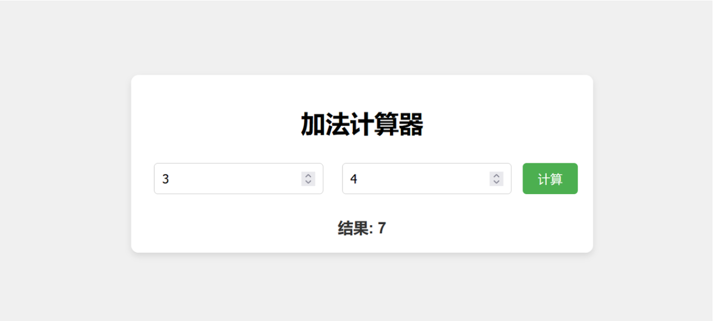
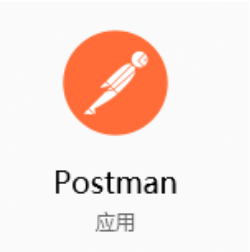
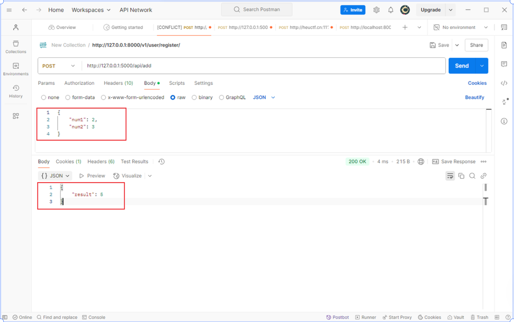
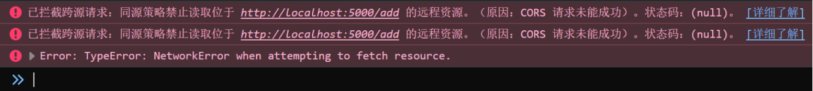
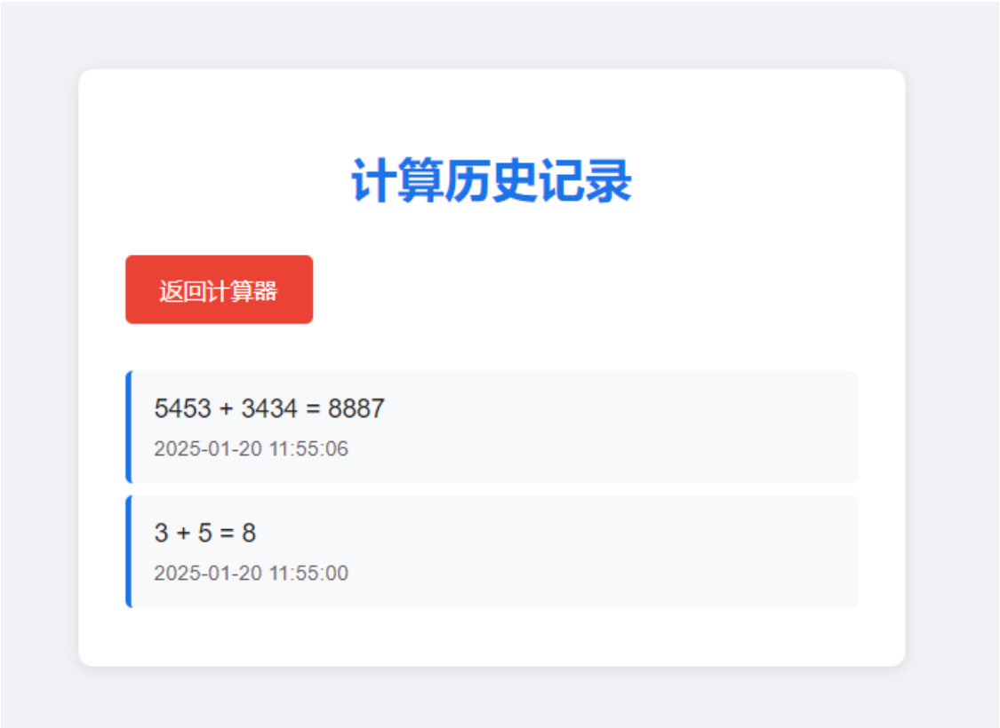

# 前后端加法器的实现

<!-- <CustomMeta /> -->

::: tip
需求：我希望制作一个网页。

- 前端：网页里有两个输入框，用户在两个输入框分别输入两个数字，并将这两个数字发送给后端。

- 后端：接收这两个数字，并将这两个数字加起来，将结果返回给前端，让前端在页面上展示结果。
  后端开发语言任选，可以用 Python，Go，Java，C++ 等。
:::



拓展：如果我想要把每次的计算记录保存起来呢？

> 思路 1：文件存取
> 思路 2：<strong>数据库</strong>

## 学习内容和资料

### 核心逻辑

这个需求的核心逻辑就是<strong>加法</strong>了，实现加法在我们 C 语言里已经早早学过，也就是：

```c
int add(num1, num2) {
    return num1 + num2;
}
```

如果使用的 `Python`，那么算法就是：

```python
def add(num1, num2):
    return num1 + num2
```

如果使用的是 `Go` 语言，那么算法就是：

```python
func add(a int, b int) int {
    return a + b
}
```

由此可见，我们只要接收到从网页前端传来的两个数据作为<strong>参数</strong>传入 `add` 函数，就可以得出计算结果了。之后，我们将函数的返回值传回<strong>前端网页</strong>，就可以让前端展示出来了。

思路是不是特别简单？

### 网页制作

根据需求，我们可以了解到，我们首先要做出来一个界面来，所以，我们还要创造一个网页来。

不过这也很简单，我们在 [康文昌老师的课程](https://www.bilibili.com/video/BV1eF411x7g5/?share_source=copy_web&vd_source=54b55542474b885b589dd23e8edb6b98)里已经学会了网页制作，但这里，我们要注意，网页要有两个逻辑功能，一是发送><strong>请求</strong>到后端，而是接收后端传来的结果到前端，那么，我们就要用到 JS 了。

```html
<!DOCTYPE html>
<html lang="zh-CN">
    <head>
        <meta charset="UTF-8">
        <meta name="viewport" content="width=device-width, initial-scale=1.0">
        <title>加法计算器</title>
        <link rel="stylesheet" href="add.css">
    </head>
    <body>
        <div class="container">
            <h1>加法计算器</h1>
            <input type="number" id="num1" placeholder="请输入第一个数字">
            <input type="number" id="num2" placeholder="请输入第二个数字">
            <button onclick="sendData()">计算</button> <!-- 点击按钮，调用函数 -->
            <div class="result" id="result"></div>
        </div>
    </body>
    <script src="add.js"></script>
</html>
```

### 网络请求

#### 什么是网络请求

简单来说，网络请求就是一方（比如网页）向另一方（比如后端服务器）提问或请求数据，服务器则根据请求给出相应的答复。

可以将网络请求比作打电话：

#### 网络请求的常见类型

这里先介绍两种，一是 GET 请求，二是 POST 请求。

- <strong>GET 请求</strong>：请求某个资源（例如网页、图片等）。

  - 示例：用户在浏览器输入网址并按下回车，浏览器会发送一个 GET 请求，服务器返回网页。
  - <strong>用途</strong>：主要用于<strong>获取</strong>数据。
- <strong>POST 请求</strong>：向服务器发送数据（例如表单提交、用户输入的内容等）。

  - 示例：你在注册页面填写用户名和密码，点击提交，浏览器会将这些数据通过 POST 请求发送给服务器，服务器处理后可能返回注册成功或失败的消息。
  - <strong>用途</strong>：主要用于<strong>提交</strong>数据。

#### 我们该如何发送网络请求

通常我们可以使用 JS 的 `fetch()` 来实现，例如发送一个 GET 请求：

```javascript
fetch("https://api.example.com/data") // 向某某服务器链接请求
  .then(response => response.json())  // 解析服务器返回的 JSON 数据
  .then(data => {
    console.log(data);  // 在控制台打印返回的数据
  })
  .catch(error => console.error("Error:", error)); // 错误处理
```

或是实现一个 POST 请求：

```javascript
fetch("https://api.example.com/submit", {
  method: "POST",  // 指定请求方法
  headers: {
    "Content-Type": "application/json"  // 设置请求头为 JSON 格式
  },
  body: JSON.stringify({  // 请求体，传送的数据
    username: "user1",
    password: "password123"
  })
})
  .then(response => response.json())  // 解析服务器返回的数据
  .then(data => {
    console.log(data);  // 打印返回的数据
  })
  .catch(error => console.error("Error:", error));
```

#### 数据要以什么样的形式传输呢

通常，我们把数据装进 JSON 格式里去传输，JSON 的语法是由<strong>键值对</strong>组成，还可以嵌套对象或者数组结构，常用于前后端的数据交换。具体的一个示例如下：

```json
{
  "name": "Fuxuan",
  "age": 19,
  "isStudent": true,
  "address": {
    "street": "Nantong St",
    "city": "Harbin"
  },
  "phoneNumbers": ["123-456-7890", "987-654-3210"],
  "hobbies": ["reading", "coding"]
}
```

而我们的这个任务，它的 JSON 格式就是：

```json
{
    "num1": 替换为用户输入的第一个数字,
    "num2": 替换为用户输入的第二个数字
}
```

所以我们的 JS 代码可以这样写：

```javascript
function sendData() {
    const num1 = document.getElementById("num1").value;
    const num2 = document.getElementById("num2").value;
    if (num1 === "" || num2 === "") {
        alert("请输入两个数字");
        return;
    }
    fetch("http://localhost:5000/api/add", {
        method: "POST",
        headers: {
            "Content-Type": "application/json"
        },
        body: JSON.stringify({
            num1: parseFloat(num1),
            num2: parseFloat(num2)
        })
    })
        .then(response => response.json())
        .then(data => {
            if (data.result !== undefined) {
                document.getElementById('result').textContent = `结果: ${data.result}`;
            } else {
                document.getElementById('result').textContent = '计算出错，请重试。';
            }
        })
        .catch(error => console.error('Error:', error));
}
```

### 后端框架

框架，就是为了简化开发流程的。而后端框架，它可以帮我们便捷处理网络请求、简化数据库操作等等。很多编程语言都提供了自己的后端框架，大家可以自行了解应用。

当然，学习后端框架的前提是掌握一门对应的编程语言，不过大家有了 C 语言的基础，上手其他语言也会非常轻松。在网上随便找个几分钟的<strong>速成</strong>课就行。

由于这里的加法只用到了一个 POST 请求，核心逻辑只写一个 API 接口就够了，很容易。为了测试，我们下载一个工具，叫做 Postman：



这里我们可以将写好的接口用 Postman 工具去测试，模拟前端的网络请求，看看可不可以成功。



得到响应的 JSON 和状态码 200 OK：

```json
{
    "result": 5
}
```

这就证明后端成功了。

> [!TIP]
> 为什么我们要使用 Postman 去测试呢？Postman 的功能是模拟前端传来的网络请求；在实际的开发中，前端和后端往往不是同一人开发，并且也往往不是同步完成。

- 这时，后端如果编写完程序但是前端还没有写完，那么后端就可以使用 Postman 去模拟前端的请求了；
- 同时，这也可以帮助我们判断 Bug 的问题是出现在前端还是出现在后端。如果后端使用 Postman 成功得到响应但是前端却没有得到，那么就证明后端的逻辑和接口往往是没问题的，Bug 可能就是出现在前端；
- 当然，最常见的后端接口可以用 Postman 跑通但是前端却接收不到数据的情况就是<strong>跨域问题</strong>了，见下文，这个问题在前后端都可以解决。不过这个问题一般在后端配置，如果后端没有配的话，就需要前端解决了。

### 跨域问题

当前端和后端分别在不同的端口运行时，浏览器会限制前端访问后端的数据，防止潜在的安全问题，这就是<strong>跨域</strong>问题。这个问题很常见，由于大家使用后端语言和框架的不同，大家可以自行上网解决。



如果是 Python 的 Flask 框架，只需要在前面加上两行代码就可以了。

```python
from flask import Flask, request, jsonify

from flask_cors import CORS  # 导入 CORS

app = Flask(__name__)

CORS(app)  # 启用跨域资源共享
```

如果是 Go 语言的 Gin 框架，同样也是两行代码解决。

```go
package main

import (
    "github.com/gin-contrib/cors"
    "github.com/gin-gonic/gin"
    "net/http"
)

// 核心代码省略

func main() {
    r := gin.Default()

    r.Use(cors.Default())

    r.POST("/api/add", UsingAddFunction)

    r.Run(":5000") // 这里我在 5000 端口启动，你们可以任选，但是不能占用本机的端口
}
```

### 代码实现

> [!TIP]
> 仓库链接：[https://github.com/FuxuanNet/frontend-backend-addition](https://github.com/FuxuanNet/frontend-backend-addition)

#### Python Flask 框架：

```python
from flask import Flask, request, jsonify

from flask_cors import CORS  # 导入 CORS

app = Flask(__name__)
CORS(app)  # 启用跨域资源共享

def add(num1, num2):
    return num1 + num2

@app.route("/api/add", methods=["POST"])
def UsingAddFuction():?
    data = request.get_json()
    num1 = data.get("num1")
    print("传入的第一个数字", num1)
    num2 = data.get("num2")
    print("传入的第二个数字", num2)

    if num1 is None or num2 is None:
        return (
            jsonify({"error": "Missing input numbers"}),
            400,
        )  # 如果输入的数字缺失，返回错误信息和状态码 400（请求错误）。

    result = add(num1, num2)
    print("加法结果", result)
    return jsonify(
        {"result": result}
    )  # 这行代码将加法结果 result 以 JSON 格式返回给客户端，客户端会看到 {"result": result}。

if __name__ == "__main__":
    app.run(debug=True)
```

#### Go Gin 框架：

```go
package main

import (
    "github.com/gin-contrib/cors"
    "github.com/gin-gonic/gin"
    "net/http"
)

func add(num1, num2 float32) float32 {
    return num1 + num2
}

func UsingAddFunction(c *gin.Context) {
    var Data struct {
        Num1 float32 `json:"num1"`
        Num2 float32 `json:"num2"`
    }
    if err := c.ShouldBindJSON(&Data); err != nil {
        c.JSON(http.StatusBadRequest, gin.H{"error": err.Error()})
        return
    }

    result := add(Data.Num1, Data.Num2)

    c.JSON(http.StatusOK, gin.H{"result": result})
}

func main() {
    r := gin.Default()

    r.Use(cors.Default())

    r.POST("/api/add", UsingAddFunction)

    r.Run(":5000")
}
```

##### Go 的命名惯例：

- Go 语言非常强调代码的简洁性和可读性。通常情况下，会使用短小的字母作为变量名，尤其是对于局部变量。
- <strong>常见的惯用变量名</strong>：

  - `c` — `context`，例如用于 HTTP 请求的上下文对象。
  - `r` — `router`，表示路由对象。
  - `w` — `writer`，表示响应的写入器。
  - `err` — `error`，表示错误信息。
  - `h` — `handler`，表示处理函数。
  - `s` — `server`，表示服务器对象。

这些命名习惯都是为提高代码的可读性，特别是在函数或方法的参数、局部变量中，避免不必要的冗长名称。

### 存储记录

> [!TIP]
> 还记得我们在前面提到了一个附加的需求吗？那就是存储每次计算的结果作为历史记录。
> 我们在学习 C 语言的时候知道，数据是存储在内存里的，程序运行结束，那么内存就会被释放，数据也就丢失了。
> 所以，如果我们想要将数据保存起来，那就要想办法存在外存里，也就是放到文件里。一般我们将用户的数据放到 JSON 格式等文件，或者是存储到数据库里面。



这个功能也很简单：

1. 建立一个数据库
2. 把每次计算结果存到数据库里（在之前的 POST 请求里顺便加上存储数据库的功能）
3. 查询数据库并将结果返回到前端（GET 请求）

代码可以看一下[前后端加法器](https://github.com/FuxuanNet/frontend-backend-addition)。


Python Flask 代码：

```python
from flask import Flask, request, jsonify

from flask_cors import CORS  # 导入 CORS

import sqlite3
from datetime import datetime

app = Flask(__name__)
CORS(app)  # 启用跨域资源共享

# 创建数据库和表
def init_db():
    conn = sqlite3.connect("calculations.db")
    c = conn.cursor()
    c.execute(
        """
        CREATE TABLE IF NOT EXISTS calculations
        (id INTEGER PRIMARY KEY AUTOINCREMENT,
         num1 REAL NOT NULL,
         num2 REAL NOT NULL,
         result REAL NOT NULL,
         timestamp TEXT NOT NULL)
    """
    )
    conn.commit()
    conn.close()

def add(num1, num2):
    return num1 + num2

@app.route("/api/add", methods=["POST"])
def using_add_function():
    data = request.get_json()
    num1 = data.get("num1")
    num2 = data.get("num2")

    if num1 is None or num2 is None:
        return (
            jsonify({"error": "Missing input numbers"}),
            400,
        )  # 如果输入的数字缺失，返回错误信息和状态码 400（请求错误）。

    result = add(num1, num2)

    # 保存计算记录到数据库
    conn = sqlite3.connect("calculations.db")
    c = conn.cursor()
    c.execute(
        """
        INSERT INTO calculations (num1, num2, result, timestamp)
        VALUES (?, ?, ?, ?)
    """,
        (num1, num2, result, datetime.now().strftime("%Y-%m-%d %H:%M:%S")),
    )
    conn.commit()
    conn.close()

    return jsonify(
        {"result": result}
    )  # 这行代码将加法结果 result 以 JSON 格式返回给客户端，客户端会看到 {"result": result}。

@app.route("/api/history", methods=["GET"])
def get_history():
    conn = sqlite3.connect("calculations.db")
    c = conn.cursor()
    c.execute("SELECT * FROM calculations ORDER BY timestamp DESC")
    rows = c.fetchall()

    history = []
    for row in rows:
        history.append(
            {
                "id": row[0],
                "num1": row[1],
                "num2": row[2],
                "result": row[3],
                "timestamp": row[4],
            }
        )

    conn.close()
    return jsonify(history)

if __name__ == "__main__":
    init_db()
    app.run(debug=True)
```

当然也可以进行 API 和数据库逻辑代码的封装，具体大家可以自行实现。
