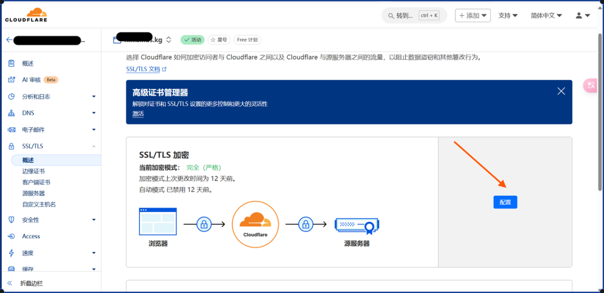

# 如何拥有一台免费的服务器和免费的二级域名

作者：张福轩，王云潮

::: warning
拥有一台属于自己的服务器，就像拥有一位 24 小时待命的小兵，可以用它来学习 Linux、搭建网站、运行自动化脚本等，非常有趣。本文将教你如何获得一台免费的个人服务器，并为其配置一个精美的控制面板以及免费的域名。
:::

## 学生认证领取 Aurze 免费服务器

::: tip
微软 Azure 为学生提供免费的服务器，只需通过学生认证，即可获得一台 1 核 1G 内存的服务器（12 个月免费使用，附赠 100 美元的云服务额度）。认证过程只需使用**学校邮箱**。
:::

### 注册学校邮箱

::: tip
进入[哈尔滨工程大学邮件系统](https://mail.hrbeu.edu.cn/coremail/index.jsp?nodetect=true)，点击右上角的注册按钮，即可完成校内用户的注册。
:::


### 使用学校邮箱进行 Aurze 学生认证

::: tip
进入[面向学生的 Azure - 免费帐户额度 | Microsoft Azure](https://azure.microsoft.com/zh-cn/free/students/)
:::


- 进入上述网址后，点击如图按钮，登录自己的**微软账号**，开始学生认证（如果没有微软账号，按照以下过程创建一个，以用 QQ 邮箱注册为例）

  - 进入设置界面，点击登录，然后创建用户，输入自己的 QQ 邮箱后，完成填写信息-接受验证码-人机验证的步骤就可以成功创建
- 第二步就是进行**学生验证**
  
  
  
  在填写信息的时候注意，名字和姓氏可以向图片中所示的那样随便一点，但是**地区，学校，学校邮箱**必须是真的，填写完信息以后点击**验证学术地位**，验证的时候会用**学校邮箱**发验证（发一次可能收不到，多发几次，一般两次就够了）

  
  
  点击上面的那个冒蓝光的 `url`，会跳转到一个页面
  
  
  
  点击 `start puzzle`，完成人机验证，再点击 `veritify`，就可以了。之后返回刚刚填写信息的页面，刷新一下
  
  
  信息填写和刚刚差不多，和**自己学校**的吻合就可以，点击注册（**一定要注意，电子邮箱还是****学校的邮箱****，要不然验证不通过**）
  通过以后就会跳转到新页面，接下来就是创建**虚拟机**了。

### 进入 Aurze 注册免费服务器

- 创建虚拟机

  - 跳转后的页面刷新一下


配置什么的按照图中的选就好，大小一定选带**免费**的，后面会有括号，括号里写着有**免费试用额度**，具体见上图，下拉菜单没有的话就点击**查看所有大小**（注意：虚拟机名称也是要填的）


用户名和密码一定要记住，一会儿密码或者 `SSH` 连接用得着。


剩下的就不用了，直接点击**查看**加**创建**


把手机号填了就可以创建了


稍等一会儿就好了，点击转到资源


这样的话服务器就创建好了

- 转管理员权限

  - 由于对某些文件的编辑以及访问只有管理员才有权限，所以我们创建好服务器以后做的第一件事就是将普通用户转为 `root`（管理员），首先我们先远程连接我们的服务器。
  
  - 我们打开电脑里的终端，根据自己的用户名和密码改动 `ssh your_name@your_server_ip`，就可以连接了。
  
  - 之后我们对其进行更改，具体的操作见本文的安装 `1Panel` 部分。

- 运维面板 `1panel` 的安装
  
  相较于 `Windows` 图形化界面，直接使用终端利用命令实现对文件的修改有点麻烦，这里为了方便就需要安装一个 `1panel`，方便我们管理服务器中的资源，同样详见下面。

### 注册谷歌账号

::: danger
预警：后面的很多登录页面需要我们注册！但如果我们有**Google 账号和 Gmail 邮箱**，就会非常方便。
如果您因为**网络问题**无法访问谷歌，请忽略这一步，后面应该也可以使用微软账号和学校邮箱或 QQ 邮箱。
:::

::: tip
注册谷歌账号时有一个地方可能会踩坑，那就是会遇到我们的中国手机号会提示**无法认证**等问题。
下面，我们来讲解一下如何规避这个问题。

> 参考文章：
> 
> - [关于注册Google账号时遇到“此电话号码无法用于进行验证”的问题的解决方法](https://blog.csdn.net/qaqwqaqwq/article/details/130442226)
:::

1. 在准备注册之前，我们需要打开我们浏览器的**设置**，在语言一栏中添加**英语**，并**以此语言显示浏览器界面的内容**，同时把英文**移到顶部**。

   

2. 移除**中文**语言（注册完之后可以重新加上去）

   

3. 重新加载浏览器，然后打开**无痕窗口**，以此清除之前的记录

## 安装 1Panel

::: tip
> `1Panel` 是一个监控面板，可以监控服务器的情况并可视化，还可以方便地进行文件操作例如上传或是查看，同时它也会自带一个终端。并且它是一个网站，所以我们也可以在手机上远程控制服务器了。
:::

### 允许 `root` 账号密码/密钥登录

::: danger
下面是 `ChatGPT` 给出的教程，注意鉴别虚实。
:::

要允许 `root` 用户登录，你需要修改 `SSH` 配置文件。以下是步骤：

并将其修改为：

### 使用 Termius 连接服务器或用终端使用 SSH 连接

::: tip
>`1Panel` 使用命令行下载，所以我们需要连接到服务器终端，下载 `Termius` 或使用 `ssh 用户名@IP 地址` 输入服务器用户和密码就可以连接上了。
:::

### 安装 1Panel 并配置端口信息

1. 首先确保系统源已更新：

```bash
sudo apt update && sudo apt upgrade -y
```

1. 根据[在线安装 - 1Panel 文档](https://1panel.cn/docs/installation/online_installation/)，我们需要执行如下指令。

   > 代码的意思是先拉取 `test-docker.sh` 文件到当前文件夹，然后在当前文件夹执行该文件。

```bash
curl -sSL https://resource.fit2cloud.com/1panel/package/quick_start.sh -o quick_start.sh && sudo bash quick_start.sh
```

1. 然后根据指示，首先是设置安装路径，这里我们**默认**即可，什么都不填，直接回车。

2. 之后是设置默认端口号，我们选取一个**不常用的端口号**填上，不要选择常用的数字或是简单的，最好选择大一些复杂的，但也注意不要超出端口范围。

   

3. 假设我们选的是 `15215` 端口，后面我们要去 `Aurze` 的网络安全组开通这个端口号，所以这里先记下。之后我们进行下一步，设置 1Panel 安全入口，这里**默认**回车即可。

4. 下一步是设置 1Panel 面板**用户名和密码**，这里既可以使用默认的随机名称和密码，也可以自己起一个，因为后面都可以在面板里更改。

5. 最后一步是显示刚刚填的所有信息，我们需要**全部复制保存下来**，**记住要保存**！**紫色划线的链接**就是我们的**面板网络地址**，不过我们现在还不能访问，还需要在***Aurze 云服务器**上添加我们刚刚给我们的面板开放的**端口**（也就是前面假设的 `15215` 端口，如果你设置了其他的，需要换成你自己的）。


### 在 Aurze 上开放 1Panel 入站端口

回到 [Microsoft Azure](https://portal.azure.com/)，我们找到**网络设置**，把我们的**入站端口**添加上就可以了。


这里我们刚刚假设我们的面板端口是 `15215`，那么我们就将其添加上去，这样我们就可以访问了。


### 使用 `IP + 端口` 访问面板

现在就可以刚刚的那个链接了，输入我们刚刚保存的用户名和密码，进入后页面如下，是不是特别酷。


我们可以点击侧边栏中的**系统**，就可以使用服务器中的**终端**还有**文件**了。

## GitHub 申请获取免费域名机会

### 注册 GitHub 账号

::: tip

GitHub 是全球知名的代码托管平台，不过很多国内用户在访问的时候会遇到网络问题无法打开，这里我们可以使用软件**Watt Toolkit**来加速，微软商店即可下载。

本文我们注册 GitHub 的目的，是为了通过下面网站的 KYC 校验。不过 GitHub 本身也是一个非常好的一个学习开源代码以及代码协作的平台，相信不少读者已经使用过。

另外，建议在校时利用定位完成**GitHub 的学生认证**，会有更多好处。
:::

### 注册二级域名申请网站

### 注册 Cloudflare

1. 进入 [Cloudflare | Web Performance & Security 官网](https://dash.cloudflare.com/login)，按正常流程进入 cloudflare 并完成注册后，我们输入我们之前填的**域名**（也就是上一步中提示要 **Name Server 的域名**），点击继续。

   

2. 选择最底下免费的，点击**继续**。

   

3. 这时，我们就会看到我们想要的 **Name Server** 了，刚好两个，把这两个**分别复制**到我们之前抢注域名的网页就可以了，就是我让大家不要关闭的那个页面。

   

4. 复制完成后点击注册，我们就拥有了我们自己的域名了。**半年后**记得登录账号续下一年的。

   

## 将域名和服务器的面板绑定到一起

::: tip
现在，我们已经可以用 `ip:端口/安全入口` 的方式连接到我们的控制面板 `1Panel` 上了，访问 `1Panel`，点击侧边栏中的**系统**，我们就可以在这里操作终端，增删文件了。不过，我更希望不要这么赤裸裸地暴露我的 ip。例如，我想要给我的面板网页或是服务器的主页加一个**域名**。假设你之前注册的域名是 `username.us,kg`，那么我希望，面板的域名可以是在原先**根域名**的前面加上******board**`.username.us.kg`，或是其他的自定义域名。

下面，我们看一看如何实现。
> 参考文章：
>
> - [使用 Nginx 搭建反向代理](https://zhuanlan.zhihu.com/p/138007915)
:::

### 安装 Nginx

1. 更新源并安装 `Nginx`

```bash
sudo apt update
sudo apt install nginx
```

1. 安装完成后，输入下面的命令来验证它是否被启动

```bash
sudo systemctl status nginx
```

预计会出现下面的输出：

```bash
nginx.service - A high performance web server and a reverse proxy server
     Loaded: loaded (/lib/systemd/system/nginx.service; enabled; vendor preset: enabled)
     Active: active (running) since Sat 2020-05-02 20:25:43 UTC; 13s ago
...
```

1. 接下来我们测试是否安装成功，我们试一试访问我们的 IP。直接在浏览器输入你的 IP，如果是下面的这种界面，那么就证明安装成功了。

   

2. 这个欢迎界面好像有点简陋了，其实，这个页面的源代码的路径就在 `/var/www/html/index.nginx-debian.html`，我们可以自行修改成自己喜欢的页面，例如我放了一个好看的 404 背景，浏览器访问我的 IP 就会看到这样的背景图。

   

### 注册 SSH 网站证书

::: tip
现在，我们已经实现了用 **IP** 或是 **IP 搭配端口和安全入口**访问我们的**服务器 Nginx 主页**和 **1Panel 面板主页**。接下来我们要做的就是用我们之前申请下来的**免费域名**，也就是刚刚举的 `user.us.kg` 域名来反向代理。
:::

### 使用 Nginx 添加反向代理

1. 获取 SSL 网站证书后，下载压缩包，解压到本地的一个文件夹里，然后把这个文件夹的所有文件都上传到 `/var/www/certificates/` 里面。可以使用我们的 **1Panel 面板的**系统-> 文件**功能来实现从本地批量拖拽上传，非常方便。

2. 那么，我们的 `certiflcates` 文件夹下就会有 `/var/www/certificates/fullchain.crt` 和 `/var/www/certificates/private.pem` 了，再次**检查核对路径正确**后，进行下一步。

3. 完成 IP Nginx 主页的反向代理（也就是前面可以改页面源代码放好看图片的那个），我们找到 `/etc/nginx` 文件夹，打开 **nginx.conf** 文件，这里就是我们的配置文件了，我们要增加的是 `http` 这一栏。

   

4. 翻到 http 的最后结尾处，把下面的代码加上，层级关系见下图。

   
   代码如下，注释里提到的需要改成自己的：

```bash
## user.us.kg 首页面板
    server {
        listen 80;
        listen 443 ssl http2; # https
        
        # 定义服务器的域名。当请求的域名与此匹配时，将使用这个服务器块处理请求。
        server_name ueser.us.kg; # 这里放你的域名 // [!code ++]
    
    # 指定网站的根目录，所有相对路径的文件请求都将从这个目录开始查找。
    root /var/www/html;

    # 这个是你的证书的存放位置，注意该路径下你的文件是否存在，如自定义证书路径，请更改。
    ssl_certificate /var/www/certificates/fullchain.crt; # 请更改 // [!code ++]
    ssl_certificate_key /var/www/certificates/private.pem; # 请更改 // [!code ++]
    
    # 定义默认的首页文件名。当用户请求根目录时，如果该文件存在，将返回该文件。
    index index.html; # 这里放你自己的首页前端 HTML 代码的文件名。 // [!code ++]

    location / {# 尝试按照顺序查找文件：首先是请求的URI，如果不存在，则尝试添加斜杠查找目录，如果仍不存在，则返回404错误。
        try_files $uri $uri/ =404;
            }
        }
```

5. 同理，我们也可以反向代理我们的 `1Panel` 面板，代码如下：

> `Board` 有面板的意思，所以我起了个这个名字，当然你们也可以自定义。

```bash
## board.user.us.kg 1Panel面板
    server {
            listen 80;
            listen 443 ssl http2;

            server_name board.user.us.kg; # 这里放你的域名 // [!code ++]

            # 这个是你的证书的存放位置，注意该路径下你的文件是否存在，如自定义证书路径，请更改。
            ssl_certificate /var/www/certificates/fullchain.crt; # 请更改 // [!code ++]
            ssl_certificate_key /var/www/certificates/private.pem; # 请更改 // [!code ++]

            # Specify SSL settings
            ssl_session_timeout 1d;
            ssl_session_cache shared:MozSSL:10m;
            ssl_session_tickets off;

            ssl_protocols TLSv1.2 TLSv1.3;
            ssl_ciphers ECDHE-ECDSA-AES128-GCM-SHA256:ECDHE-RSA-AES128-GCM-SHA256:ECDHE-ECDSA-AES256-GCM-SHA384:ECDHE-RSA-AES256-GCM-SHA384:ECDHE-ECDSA-CHACHA20-POLY1305:ECDHE-RSA-CHACHA20-POLY1305:DHE-RSA-AES128-GCM-SHA256:DHE-RSA-AES256-GCM-SHA384;
            ssl_prefer_server_ciphers off;

            # OCSP Stapling
            ssl_stapling on;
            ssl_stapling_verify on;

            # Redirect HTTP to HTTPS
            if ($scheme = http) {
                return 301 https://$server_name$request_uri;
            }

        location / {
            proxy_pass http://127.0.0.1:12512; # 修改这个端口，变成你自己面板的端口。 // [!code ++]
            proxy_http_version 1.1;
            proxy_read_timeout 300;
            proxy_set_header Upgrade $http_upgrade;
            proxy_set_header Connection "upgrade";
            proxy_set_header Host $http_host;
            proxy_set_header X-Real-IP $remote_addr;
            proxy_set_header X-Real-PORT $remote_port;
        }
    }
```

6. 之后，我们记得保存文件。

7. 来到服务器**终端**，首先**检查**改动是否正常，输入：

```bash
sudo nginx -t
```

结果若为：

```bash
nginx: the configuration file /etc/nginx/nginx.conf syntax is ok
nginx: configuration file /etc/nginx/nginx.conf test is successful
```

则检查没问题。

8. 之后，更新一下我们的配置。（每次修改完 `Nginx` 配置文件后都要这么做）

```bash
sudo nginx -s reload
```

Nginx 的配置就完成了，下面我们还差 `Cloudflare`。

### 在 `Cloudflare` 里将域名解析到我们对应的 IP 上

::: tip 
现在，我们需要在 `Cloudflare` 上把我们的域名和 IP 绑定起来。首先我们绑定一下我们的面板 `board.``user``.us.kg` 到我们的 `IP`。注意类型选择 `A`，名称填写面板的范域名的前缀 `board`，点击 `保存`。
:::


>
> 接下来是我们的根域名，注意名称这次填写 `@`，同样是填写你的 `IP`，点击 `保存`。


### 设置 Cloudflare 安全等级

::: tip
> 参考文章：
>
> - [解决使用 Cloudflare 出现重定向次过多问题 - 【NUTSWP】](https://nutswp.com/%E8%A7%A3%E5%86%B3%E4%BD%BF%E7%94%A8cloudflare%E5%87%BA%E7%8E%B0%E9%87%8D%E5%AE%9A%E5%90%91%E6%AC%A1%E8%BF%87%E5%A4%9A%E9%97%AE%E9%A2%98/)
:::

当我们做好以上配置以后，放我们的默认页面，发现会出现这样一个页面


对于这种情况，我们要进入 Cloudflare

首先选中自己的域名





然后保存就可以了，再输入自己的网址就可以正常跳转到页面了


