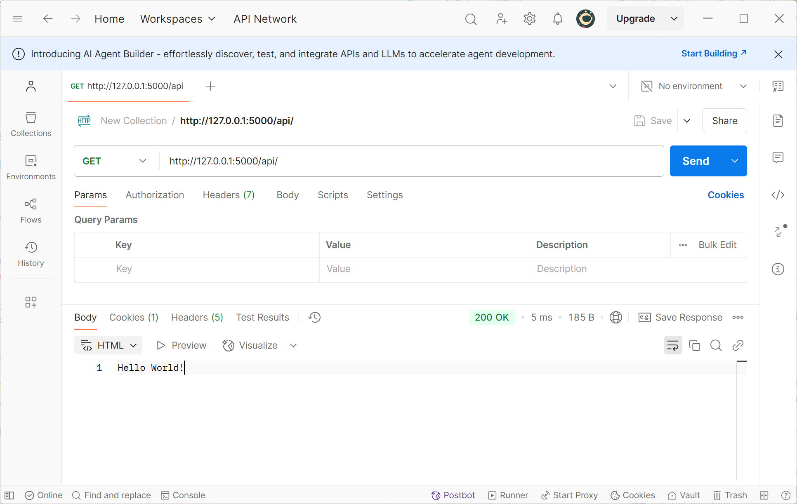
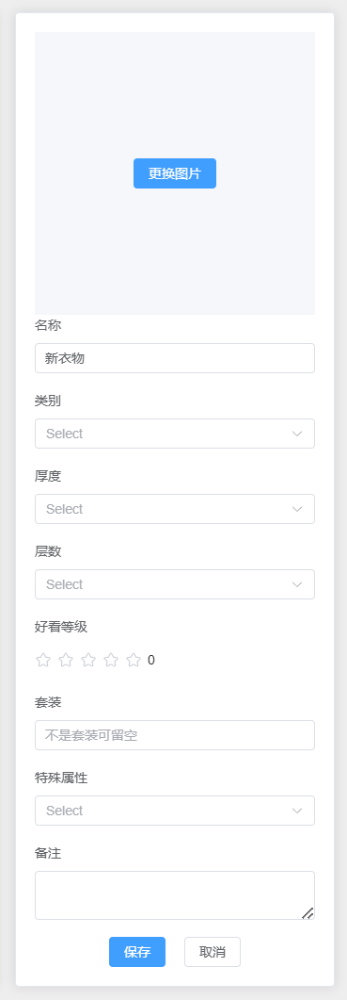

# 实现一个衣物管理平台

## 前端

## 后端

创建一个文件夹，专门放后端的代码。

### 第一步：创建一个 Flask 示例

我们先用 Flask 实现一个简单的 GET 请求，来看看是否可以接收到模拟传来的网络请求。

在文件夹中创建一个 `run.py` 文件，输入以下代码：

::: code-group

```python [run.py]
from flask import Flask
app = Flask(__name__)

@app.route("/api/", methods=["GET"])
def home():
    return "Hello World!"

if __name__ == "__main__":
    app.run(debug=True)
```

:::

运行 `python run.py` 启动服务。

::: tip
127.0.0.1 是本机的 默认 IP，Flask 的默认启动端口是 `5000`，所以访问 `http://127.0.0.1:5000/api/` 可以看到返回了 `Hello World!`。

同时使用 Postman 也可以看到返回了相同的结果。


:::

### 第二步：明确我们的需求

::: tip
在前端的实现中，我们知道了我们的衣物管理系统，首先就是需要优先实现一个衣物列表，然后可以添加衣物，删除衣物，修改衣物，查看衣物详情。

衣物列表需要存储在数据库里，添加、修改、删除衣物则需要我们后端提供一个 API 接口，前端通过调用这个接口来实现添加、修改、删除衣物，后端接受到请求后就可以查询数据库进行交互了。

所以我们的后端主要实现两个功能：

1. 数据库的创建与存储
2. API 接口的实现
:::

前端传来的 JSON 格式大概示例如下：

```JSON
{
  "name": "T-shirt",
  "image": "图片",
  "category": "Shirt",
  "thickness": "Medium",
  "layer": "Single",
  "set": "Casual",
  "rating": 4,
  "special": "Breathable fabric",
  "note": "Good for summer",
  "status": "Available",
  "isFavorite": true
}
```



所以我们的数据库也要按这样设计。同时也要给前端传来的图片找一个存储的地方。所以下面我们添加一下配置文件，来指定数据库和图片的存放位置。

### 第三步：添加配置文件

在文件夹下新建一个 `config.py` 文件，用于存放一些我们基础的配置。我们的目的是将数据库存放到后端文件夹下的 `instance` 文件夹中，将前端用户上传的图片存放到 `uploads` 文件夹中。

::: code-group

```python [config.py]
import os

class Config:
    # 获取当前文件所在目录的绝对路径
    BASE_DIR = os.path.abspath(os.path.dirname(__file__))

    # 确保 instance 目录存在
    INSTANCE_DIR = os.path.join(BASE_DIR, "instance")
    if not os.path.exists(INSTANCE_DIR):
        os.makedirs(INSTANCE_DIR)

    # 创建图片上传目录
    UPLOAD_FOLDER = os.path.join(BASE_DIR, "uploads")
    if not os.path.exists(UPLOAD_FOLDER):
        os.makedirs(UPLOAD_FOLDER)

    # 使用绝对路径指定数据库文件位置
    SQLALCHEMY_DATABASE_URI = f'sqlite:///{os.path.join(INSTANCE_DIR, "clothes.db")}'

    # 禁止 Flask-SQLAlchemy 的信号系统
    SQLALCHEMY_TRACK_MODIFICATIONS = False

    # 限制上传文件大小为 16MB
    MAX_CONTENT_LENGTH = 16 * 1024 * 1024
```

我们只需要在 `run.py` 中导入这个配置文件，并使用 `app.config.from_object()` 来加载就可以了。

::: code-group

```python [run.py]
from flask import Flask
from config import Config

app = Flask(__name__)
app.config.from_object(Config)

@app.route('/')
def home():
    return "Hello, World!"

if __name__ == "__main__":
    app.run(debug=True)
```

:::

不过一般我们不会这样
