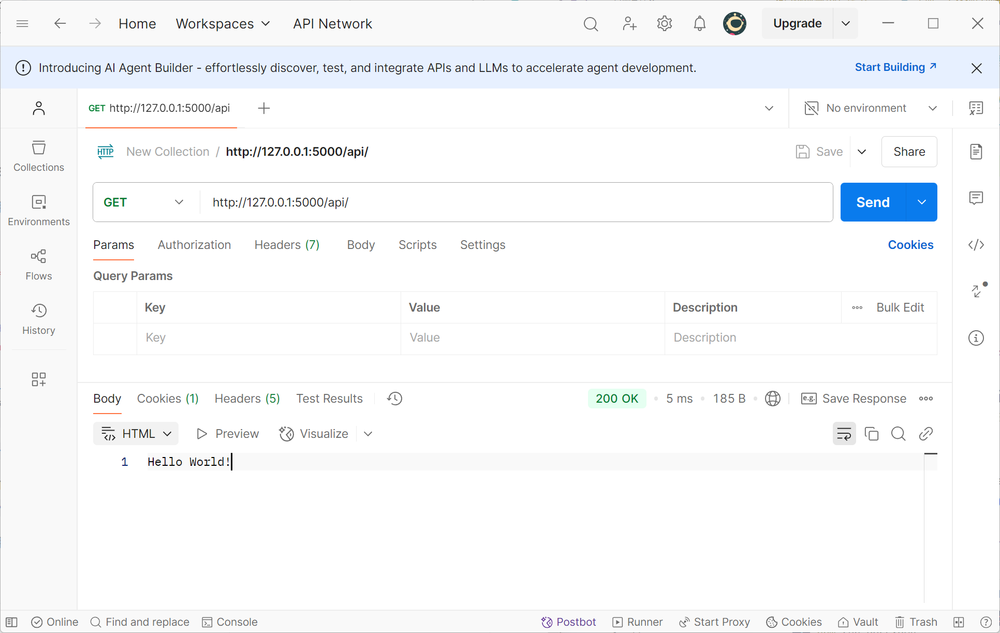

# 实现一个衣物管理平台之后端

## 第一步：创建一个 Flask 示例

我们先用 Flask 实现一个简单的 GET 请求，来看看是否可以接收到模拟传来的网络请求并返回响应。

在文件夹中创建一个 `run.py` 文件，输入以下代码：

::: code-group

```python [run.py]
from flask import Flask
app = Flask(__name__)

@app.route("/api/", methods=["GET"])
def home():
    return "Hello World!"

if __name__ == "__main__":
    app.run(debug=True)
```

:::

运行 `python run.py` 启动服务。

::: tip
127.0.0.1 是本机的 默认 IP，Flask 的默认启动端口是 `5000`，所以访问 `http://127.0.0.1:5000/api/` 可以看到返回了 `Hello World!`。

同时使用 Postman 也可以看到返回了相同的结果。


:::

## 第二步：明确我们的需求

::: tip
在我们的前端实现中，衣物管理系统的核心功能是显示衣物列表，并支持添加、删除、修改和查看衣物详情。

衣物列表需要存储在数据库里，添加、修改、删除衣物则需要我们后端提供一个 API 接口，前端通过调用这个接口来实现添加、修改、删除衣物，后端接受到请求后就可以查询数据库进行交互了。

所以我们的后端主要实现两个功能：

1. 数据库的创建与存储
2. API 接口的实现
:::

前端传来的 JSON 格式大概示例如下：

```JSON
{
  "name": "T-shirt",
  "image": "图片",
  "category": "Shirt",
  "thickness": "Medium",
  "layer": "Single",
  "set": "Casual",
  "rating": 4,
  "special": "Breathable fabric",
  "note": "Good for summer",
  "status": "Available",
  "isFavorite": true
}
```


所以我们的数据库也要按这样设计。同时也要给前端传来的图片找一个存储的地方。所以下面我们添加一下配置文件，来指定数据库和图片的存放位置。

## 第三步：添加配置文件

在文件夹下新建一个 `config.py` 文件，用于存放一些我们基础的配置。我们的目的是将数据库存放到后端文件夹下的 `instance` 文件夹中，将前端用户上传的图片存放到 `uploads` 文件夹中。

::: code-group

```python [config.py]
import os

class Config:
    # 获取当前文件所在目录的绝对路径
    BASE_DIR = os.path.abspath(os.path.dirname(__file__))

    # 确保 instance 目录存在，若不存在则自动创建。
    INSTANCE_DIR = os.path.join(BASE_DIR, "instance")
    if not os.path.exists(INSTANCE_DIR):
        os.makedirs(INSTANCE_DIR)

    # 创建图片上传目录
    UPLOAD_FOLDER = os.path.join(BASE_DIR, "uploads")
    if not os.path.exists(UPLOAD_FOLDER):
        os.makedirs(UPLOAD_FOLDER)

    # 使用绝对路径指定数据库文件位置
    SQLALCHEMY_DATABASE_URI = f'sqlite:///{os.path.join(INSTANCE_DIR, "clothes.db")}'

    # 禁止 Flask-SQLAlchemy 的信号系统
    SQLALCHEMY_TRACK_MODIFICATIONS = False

    # 限制上传文件大小为 16MB
    MAX_CONTENT_LENGTH = 16 * 1024 * 1024
```

我们只需要在 `run.py` 中导入这个配置文件，并使用 `app.config.from_object()` 来加载就可以了。

::: code-group

```python [run.py]
from flask import Flask
from config import Config # [!code ++]

app = Flask(__name__)
app.config.from_object(Config)  # [!code ++]

@app.route('/')
def home():
    return "Hello, World!"

if __name__ == "__main__":
    app.run(debug=True)
```

:::

另外，配置项被加载后，我们也可以在 Flask 应用中访问它们，例如：

```python
app.config["UPLOAD_FOLDER"]  # 获取上传文件夹路径
```

---

现在我们的 `run.py` 有了模型的初始化和一个路由的定义，但为了更好地组织代码，我们要将应用实例的初始化和路由定义分离，放到 `app` 文件夹中。

一般情况下，我们将初始化 Flask 应用实例的代码放到 `app/__init__.py` 中，将路由定义的代码放到 `app/routes.py` 中，将数据库模型定义的代码放到 `app/models.py` 中。

::: tip
`__init__.py` 是 Python 中的特殊文件，文件夹如果包含 `__init__.py` 文件，Python 就会认为是一个包，可以在其他文件中方便地导入该包里的内容。

在我们的项目中，`app` 文件夹就是一个包，`__init__.py` 文件就是该包的初始化文件，用于初始化该包的内容，主要作用是初始化和配置应用，它是整个应用的启动点。
:::

## 第四步：创建初始化模块

在文件夹下创建一个 `app` 文件夹，并在该文件夹下创建 `__init__.py` 文件，用于初始化 Flask 应用实例。

这里主要放我们前面 `run.py` 的这两行代码：

```python
app = Flask(__name__)
app.config.from_object(Config)
```

我们将其放入 `app/__init__.py` 文件中，那么 `run.py` 就可以相应地简化了。

::: code-group

```python [app/__init__.py]
from flask import Flask
from config import Config

def create_app():
    app = Flask(__name__)
    app.config.from_object(Config)

    return app
```

```python [run.py]
from flask import Flask  #  [!code --]
from config import Config  # [!code --]
from app import create_app  # [!code ++]

app = Flask(__name__)  #  [!code --]
app.config.from_object(Config)  #  [!code --]
app = create_app() # [!code ++]

# 原先的路由内容，不过这里我们马上也要单独封装了，所以这里先删去。

if __name__ == "__main__":
    app.run(debug=True)
```

:::

::: tip
`create_app()` 是 Flask 应用工厂函数，它通过封装应用的初始化过程，使得代码更加模块化、可维护，并方便在不同的环境中创建应用实例。
:::

当然了，我们还会在这个文件里添加初始化准备创建数据库和初始化连接、处理跨域问题等。

## 第五步：初始化和创建数据库

我们同样在 `app/__init__.py` 文件中添加初始化数据库的代码。

这里总共分三步：

1. 导入 `SQLAlchemy` 和 `db` 对象

   ```python
    from flask_sqlalchemy import SQLAlchemy
    db = SQLAlchemy()  # 创建 SQLAlchemy 实例
    ```

2. 初始化数据库

    ```python

    db.init_app(app)  # 初始化数据库
    ```

3. 创建数据库表

    ```python
    with app.app_context():
        db.create_all()  # 在应用上下文中创建数据库表
    ```

那么在 `app/__init__.py` 中，我们的代码就变成了这样：

::: code-group

```python [app/__init__.py]
from flask import Flask
from flask_sqlalchemy import SQLAlchemy # [!code ++]
from config import Config
import os # [!code ++]

db = SQLAlchemy() # [!code ++]

def create_app():
    app = Flask(__name__, instance_relative_config=True)  # 创建 Flask 应用实例
    app.config.from_object(Config)  # 加载配置

    # 确保存放数据库的 instance 文件夹存在，这里我们其实在 config.py 中已经配置了
    try: # [!code ++]
        os.makedirs(app.instance_path) # [!code ++]
    except OSError: # [!code ++]
        pass # [!code ++]

    db.init_app(app) # [!code ++]

    with app.app_context():
        db.create_all()  # [!code ++]

    return app
```

:::

## 第六步：创建数据库模型

这里我们创建在 `app` 文件夹里创建一个 `models.py` 文件，用于存放数据库模型。

首先我们先把在 `app/__init__.py` 里的 `db` 对象导入进来。

```python
from app import db
```

然后创建一个 `Clothes` 类，继承自 `db.Model`，并定义 `id`、`name`、`color`、`size`、`price`、`description`、`create_time`、`update_time` 等字段。

```python
from datetime import datetime

class Clothes(db.Model):
    id = db.Column(db.Integer, primary_key=True)  # 主键字段
    name = db.Column(db.String(100), nullable=False)  # 衣物名称，不能为空
    image = db.Column(db.String(200))  # 图片路径
    category = db.Column(db.String(50))  # 衣物类别
    thickness = db.Column(db.String(50))  # 衣物厚度
    layer = db.Column(db.String(50))  # 衣物层次
    set = db.Column(db.String(50))  # 衣物套装
    rating = db.Column(db.Integer)  # 衣物评分
    special = db.Column(db.String(100))  # 衣物特殊属性
    note = db.Column(db.Text)  # 衣物备注
    status = db.Column(db.String(20), default="stored")  # 衣物状态，默认为 stored
    is_favorite = db.Column(db.Boolean, default=False)  # 是否为收藏，默认为 False
    created_at = db.Column(
        db.DateTime, default=datetime.utcnow
    )  # 创建时间，默认为当前时间
    updated_at = db.Column(
        db.DateTime, default=datetime.utcnow, onupdate=datetime.utcnow
    )  # 更新时间，默认为当前时间，并在每次更新时自动更新为当前时间
```

由于前后端使用 JSON 格式进行数据的交互，所以我们在这个类里面再创建一个 `to_dict` 方法，把上面这些字段转化为 python 的字典类型，方便在返回给前端时可以快捷转化成 JSON 格式。

```python
class Clothes(db.Model):

    # ... 省略其他代码

    def to_dict(self):  # 将 Clothes 对象转换为字典格式，方便通过 JSON 格式返回给前端。
        return {
            "id": self.id,
            "name": self.name,
            "image": self.image,
            "category": self.category,
            "thickness": self.thickness,
            "layer": self.layer,
            "set": self.set,
            "rating": self.rating,
            "special": self.special,
            "note": self.note,
            "status": self.status,
            "isFavorite": self.is_favorite,
        }
```

::: tip
模型类和数据库表之间的关系是通过 db.Model 这种继承实现的。类中的每个属性对应数据库中的列，而类本身则对应一个表。这让我们能够通过 Python 对象操作数据库记录，而不需要直接写 SQL 语句。
:::

所以整个 `app/models.py` 的代码如下：

::: code-group

```python [app/models.py]
from app import db
from datetime import datetime

class Clothes(db.Model):
    id = db.Column(db.Integer, primary_key=True)  # 主键字段
    name = db.Column(db.String(100), nullable=False)  # 衣物名称，不能为空
    image = db.Column(db.String(200))  # 图片路径
    category = db.Column(db.String(50))  # 衣物类别
    thickness = db.Column(db.String(50))  # 衣物厚度
    layer = db.Column(db.String(50))  # 衣物层次
    set = db.Column(db.String(50))  # 衣物套装
    rating = db.Column(db.Integer)  # 衣物评分
    special = db.Column(db.String(100))  # 衣物特殊属性
    note = db.Column(db.Text)  # 衣物备注
    status = db.Column(db.String(20), default="stored")  # 衣物状态，默认为 stored
    is_favorite = db.Column(db.Boolean, default=False)  # 是否为收藏，默认为 False
    created_at = db.Column(db.DateTime, default=datetime.utcnow)  # 创建时间，默认为当前时间
    updated_at = db.Column(db.DateTime, default=datetime.utcnow, onupdate=datetime.utcnow)  # 更新时间，默认为当前时间，并在每次更新时自动更新为当前时间

    def to_dict(self):  # 将 Clothes 对象转换为字典，方便 JSON 响应返回给前端。
        return {
            "id": self.id,
            "name": self.name,
            "image": self.image,
            "category": self.category,
            "thickness": self.thickness,
            "layer": self.layer,
            "set": self.set,
            "rating": self.rating,
            "special": self.special,
            "note": self.note,
            "status": self.status,
            "isFavorite": self.is_favorite,
        }

```

:::

## 第七步：封装路由 API

### 创建蓝图

之后我们来封装一下 API 的路由，因为我们的路由太多了，有增加、删除、修改等，所以我们将他们封装到一个文件中，方便管理。

在 `app` 文件夹下创建一个 `routes.py` 文件，用于存放路由。

在代码里，我们首先要先创建一个 Flask 蓝图 `Blueprint`。蓝图是 Flask 中用于组织路由和视图函数的一种方式，它可以将应用中的路由和视图函数分组，使得代码更加清晰和模块化。

::: tip
Blueprint 是一种组织 Flask 应用的方式，它允许将应用拆分成多个模块，每个模块负责处理特定的功能。这样做的好处是能够让代码结构更加清晰，特别是当应用变得复杂时。
:::

我们创建一个名为 `clothes` 的蓝图，主要是负责处理衣物相关的路由。

```python
from flask import Blueprint
clothes_bp = Blueprint("clothes", __name__) 
```

这样我们就可以在这个蓝图里添加路由了。

### 获取所有衣物

例如给前端提供一个最基础的查询数据库所有衣物的 API。那么我们给一个 `/api/clothes` 的路径，前端如果来 GET 请求，就返回所有衣物的数据。

```python
from app.models import Clothes

# 获取所有衣物
@clothes_bp.route("/api/clothes", methods=["GET"])
def get_clothes():
    clothes = Clothes.query.all()
    return jsonify([item.to_dict() for item in clothes])
```

::: tip
这里解释一下 `Clothes.query.all()`：

- `Clothes` 是我们创建的数据库模型；

- `query` 是 SQLAlchemy 提供的一个查询接口；

- `all()` 方法则是查询所有记录，返回一个列表。

同时运用导入我们创建的 `Clothes` 类的 `to_dict` 方法，将字段转化为字典，再转化为 JSON 格式。
:::

### 删除指定 ID 衣物

同理，我们可以写出删除的 API，这里我们可以删除指定 ID 的衣物：

```python
# 删除衣物
@clothes_bp.route("/api/clothes/<int:id>", methods=["DELETE"])
def delete_clothes(id):
    clothes = Clothes.query.get_or_404(id)  # 查找指定 ID 的衣物记录
    db.session.delete(clothes)  # 删除该衣物记录
    db.session.commit()  # 提交事务
    return "", 204  # 返回空响应，HTTP 状态码 204 表示删除成功
```

`db.session.commit()` 是 SQLAlchemy 中用于提交事务的操作，它的作用是将当前数据库会话 `session` 中的所有变更（例如**新增、修改、删除**记录）提交到数据库中，正式保存。

::: tip
**详细解释**：

- 数据库会话（Session）：
  
  - `db.session` 是当前会话的实例，它负责跟踪对数据库的所有操作。会话可以理解为一个 事务的工作空间，它记录了所有对数据库的增、删、改操作。

- 提交事务（Commit）：
  
  - 提交事务是指将所有未保存的更改保存到数据库中。在 SQLAlchemy 中，当你执行了增、删、改操作后，这些操作只是暂存在会话中，并没有真正写入数据库。只有当你调用 `commit()` 方法后，这些操作才会被真正保存到数据库中。
  
  - 当你在数据库中进行多个操作（例如新增、修改、删除）时，`commit()` 会确保这些操作作为一个整体提交。如果在提交之前中途出现问题，可以通过回滚 `rollback()` 恢复数据，保证数据的一致性。
:::

### 添加衣物

那么添加衣物也很容易，我们只需要创建一个 POST 请求的路由，并把数据保存到数据库中就可以了。

```python
@clothes_bp.route("/api/clothes", methods=["POST"])
def add_clothes():
    data = request.json  # 从请求体获取 JSON 数据
    new_clothes = Clothes(
        name=data["name"],
        image=data["image"],
        category=data["category"],
        thickness=data["thickness"],
        layer=data["layer"],
        set=data["set"],
        rating=data["rating"],
        special=data["special"],
        note=data["note"],
        status=data["status"],
        is_favorite=data["isFavorite"],
    )
    db.session.add(new_clothes)  # 将新衣物对象添加到数据库会话
    db.session.commit()  # 提交事务，保存到数据库
    return jsonify(new_clothes.to_dict()), 201  # 返回新衣物的 JSON 数据

```

### 修改衣物属性

用户可以对指定 id 的衣物的属性进行更改，只需要使用 PUT 请求，将原先的数据覆盖掉即可。

```python
# 更新衣物
@clothes_bp.route("/api/clothes/<int:id>", methods=["PUT"])
def update_clothes(id):
    clothes = Clothes.query.get_or_404(id)  # 查找指定 ID 的衣物记录
    data = request.json  # 获取请求中的 JSON 数据

    # 更新衣物的属性
    clothes.name = data.get("name", clothes.name)
    clothes.image = data.get("image", clothes.image)
    clothes.category = data.get("category", clothes.category)
    clothes.thickness = data.get("thickness", clothes.thickness)
    clothes.layer = data.get("layer", clothes.layer)
    clothes.set = data.get("set", clothes.set)
    clothes.rating = data.get("rating", clothes.rating)
    clothes.special = data.get("special", clothes.special)
    clothes.note = data.get("note", clothes.note)
    clothes.status = data.get("status", clothes.status)
    clothes.is_favorite = data.get("isFavorite", clothes.is_favorite)

    db.session.commit()  # 提交更新
    return jsonify(clothes.to_dict())  # 返回更新后的衣物数据
```

### 接收和处理图片

接下来，我们来实现图片的接收处理接口。

#### 判断辅助函数

首先，我们需要判断用户传来的是否是图片，这可以通过图片文件夹的后缀名来判断，判断函数如下：

```python
def allowed_file(filename):
    return "." in filename and filename.rsplit(".", 1)[1].lower() in {
        "png",
        "jpg",
        "jpeg",
        "gif",
    }
```

::: tip

- `return "." in filename`：检查文件名中是否包含 `.`，即检查文件名是否有扩展名。

- `filename.rsplit[".", 1](1).lower()`：将文件名从右边按“.”分割成两部分，并取最后一部分（即文件的扩展名）。`rsplit` 的 1 参数表示最多分割一次，防止文件名中有多个点。`lower` 将后缀名都转化为小写字母。

- `in {"png", "jpg", "jpeg", "gif"}`：判断文件的扩展名是否属于常见的
图片格式（PNG、JPG、JPEG、GIF）。如果是其中之一，则返回 `True`，表示这是一个允许的图片文件类型；否则返回 `False`。
:::

#### 保存上传图片

```python
@clothes_bp.route("/api/upload", methods=["POST"])
def upload_file():
    # 检查请求中是否有文件部分
    if "image" not in request.files:
        return jsonify({"error": "No file part"}), 400

    file = request.files["image"]

    # 检查文件名是否为空
    if file.filename == "":
        return jsonify({"error": "No selected file"}), 400
    
    # 检查文件类型是否合法
    if file and allowed_file(file.filename):
        # 使用UUID生成唯一文件名
        filename = secure_filename(
            str(uuid.uuid4()) + os.path.splitext(file.filename)[1]
        )
        # 保存文件
        file.save(os.path.join(current_app.config["UPLOAD_FOLDER"], filename))

        return jsonify({"filename": filename})
    return jsonify({"error": "Invalid file type"}), 400
```

::: tip

- `filename = secure_filename(...)`：生成一个安全的文件名。
  
  - `secure_filename` 是 Flask 提供的一个函数，用于确保文件名中没有非法字符。
  
  - 这里使用 `uuid.uuid4()` 生成一个唯一的 UUID 作为文件名的前缀。
  
  - 然后通过 `os.path.splitext[file.filename](1)` 获取文件的扩展名（例如 .jpg 或 .png），将它附加到生成的 UUID 后面，确保文件名唯一。

- `return jsonify({"filename": filename})`：返回一个 JSON 响应，包含刚刚生成的文件名。这样前端就能获取到上传的文件名。

:::

#### 访问存储的图片

```python
@clothes_bp.route("/uploads/<filename>")
# 定义一个函数，用于上传文件
def uploaded_file(filename):
    # 返回上传的文件
    return send_from_directory(current_app.config["UPLOAD_FOLDER"], filename)

```

::: tip

- `return send_from_directory(...)：send_from_directory` 是 Flask 提供的函数，用于从服务器上的指定目录中发送文件。在这里，它会从配置中的上传文件夹 `UPLOAD_FOLDER` 中查找请求的文件，并将文件返回给客户端。

- 这样，客户端就可以通过 GET 请求访问上传的文件，文件的 URL 为 `/uploads/<filename>`，其中 `<filename>` 是上传时生成的文件名。
:::

#### 总结

::: tip

1. 用户通过表单上传图片时，浏览器会将图片作为 `image` 字段发送到服务器。

2. 服务器检查上传的文件是否合法（通过 `allowed_file` 函数判断文件类型）。

3. 如果文件合法，服务器生成一个唯一的文件名，并将文件保存到服务器指定的上传文件夹中。

4. 服务器返回一个包含文件名的 JSON 响应。

5. 客户端可以通过 `/uploads/<filename>` 路径访问上传的文件，服务器会将文件从上传文件夹中发送给客户端。

:::

最后，不要忘记将我们将写好的路由导入到 `app/__init__.py` 文件中。

::: code-group

```python [app/__init__.py]
from flask import Flask
from flask_sqlalchemy import SQLAlchemy
from config import Config
import os

db = SQLAlchemy()
def create_app():
    app = Flask(__name__, instance_relative_config=True)  # 创建 Flask 应用实例
    app.config.from_object(Config)  # 加载配置
    try:
        os.makedirs(app.instance_path)
    except OSError:
        pass
    db.init_app(app)

    # 导入 API 路由
    from app.routes import clothes_bp  #  [!code ++] 
    # 注册 API 蓝图
    app.register_blueprint(clothes_bp)  #  [!code ++]

    with app.app_context():
        db.create_all()

    return app
```

:::

## 第八步：处理跨域问题

这个时候，我们运行代码，会发现所有的 API 都可以再 Postman 跑通，但是，前端页面会报错，提示跨域问题。

::: danger
跨域问题是由于浏览器的同源策略导致的，简单来说，就是由于浏览器的安全策略，不允许不同源（协议、域名、端口）的网站之间进行交互。
:::

我们可以在后端做一下简单的配置，允许跨域访问，这里我们也放到 `app/__init__.py` 里。

::: code-group

```python [app/__init__.py]
from flask import Flask
from flask_sqlalchemy import SQLAlchemy
from flask_cors import CORS  # [!code ++]
from config import Config
import os

db = SQLAlchemy()  # 创建 SQLAlchemy 实例
def create_app():
    app = Flask(__name__, instance_relative_config=True)  # 创建 Flask 应用实例
    app.config.from_object(Config)  # 加载配置

    # 启用 CORS # [!code ++]
    CORS(app) # [!code ++]

    # 确保 instance 文件夹存在
    try:
        os.makedirs(app.instance_path)
    except OSError:
        pass

    db.init_app(app)  # 初始化数据库

    from app.routes import clothes_bp  # 导入 API 路由

    app.register_blueprint(clothes_bp)  # 注册 API 蓝图

    with app.app_context():
        db.create_all()  # 在应用上下文中创建数据库表

    return app

```

``` python [run.py]
from app import create_app

app = create_app()

if __name__ == "__main__":
    app.run(debug=True)

```

```python [config.py]
import os


class Config:
    # 获取当前文件所在目录的绝对路径
    BASE_DIR = os.path.abspath(os.path.dirname(__file__))

    # 确保 instance 目录存在
    INSTANCE_DIR = os.path.join(BASE_DIR, "instance")
    if not os.path.exists(INSTANCE_DIR):
        os.makedirs(INSTANCE_DIR)

    # 创建图片上传目录
    UPLOAD_FOLDER = os.path.join(BASE_DIR, "uploads")
    if not os.path.exists(UPLOAD_FOLDER):
        os.makedirs(UPLOAD_FOLDER)

    # 使用绝对路径指定数据库文件位置
    SQLALCHEMY_DATABASE_URI = f'sqlite:///{os.path.join(INSTANCE_DIR, "clothes.db")}'

    # 禁止 Flask-SQLAlchemy 的信号系统
    SQLALCHEMY_TRACK_MODIFICATIONS = False

    # 限制上传文件大小为 16MB
    MAX_CONTENT_LENGTH = 16 * 1024 * 1024
```

```python [app/routes.py]
import os
from flask import Blueprint, request, jsonify, current_app, send_from_directory
from werkzeug.utils import secure_filename
from app.models import Clothes
from app import db
import uuid

clothes_bp = Blueprint("clothes", __name__)  # 创建蓝图


def allowed_file(filename):
    return "." in filename and filename.rsplit(".", 1)[1].lower() in {
        "png",
        "jpg",
        "jpeg",
        "gif",
    }


@clothes_bp.route("/api/upload", methods=["POST"])
def upload_file():
    if "image" not in request.files:
        return jsonify({"error": "No file part"}), 400
    file = request.files["image"]
    if file.filename == "":
        return jsonify({"error": "No selected file"}), 400
    if file and allowed_file(file.filename):
        # 使用UUID生成唯一文件名
        filename = secure_filename(
            str(uuid.uuid4()) + os.path.splitext(file.filename)[1]
        )
        file.save(os.path.join(current_app.config["UPLOAD_FOLDER"], filename))
        return jsonify({"filename": filename})
    return jsonify({"error": "Invalid file type"}), 400


@clothes_bp.route("/uploads/<filename>")
# 定义一个函数，用于上传文件
def uploaded_file(filename):
    # 返回上传的文件
    return send_from_directory(current_app.config["UPLOAD_FOLDER"], filename)


# 获取所有衣物
@clothes_bp.route("/api/clothes", methods=["GET"])
def get_clothes():
    clothes = Clothes.query.all()
    return jsonify([item.to_dict() for item in clothes])


# 添加新衣物
@clothes_bp.route("/api/clothes", methods=["POST"])
def add_clothes():
    data = request.json  # 从请求体获取 JSON 数据
    new_clothes = Clothes(
        name=data["name"],
        image=data["image"],
        category=data["category"],
        thickness=data["thickness"],
        layer=data["layer"],
        set=data["set"],
        rating=data["rating"],
        special=data["special"],
        note=data["note"],
        status=data["status"],
        is_favorite=data["isFavorite"],
    )
    db.session.add(new_clothes)  # 将新衣物对象添加到数据库会话
    db.session.commit()  # 提交事务，保存到数据库
    return jsonify(new_clothes.to_dict()), 201  # 返回新衣物的 JSON 数据


# 更新衣物
@clothes_bp.route("/api/clothes/<int:id>", methods=["PUT"])
def update_clothes(id):
    clothes = Clothes.query.get_or_404(id)  # 查找指定 ID 的衣物记录
    data = request.json  # 获取请求中的 JSON 数据

    # 更新衣物的属性
    clothes.name = data.get("name", clothes.name)
    clothes.image = data.get("image", clothes.image)
    clothes.category = data.get("category", clothes.category)
    clothes.thickness = data.get("thickness", clothes.thickness)
    clothes.layer = data.get("layer", clothes.layer)
    clothes.set = data.get("set", clothes.set)
    clothes.rating = data.get("rating", clothes.rating)
    clothes.special = data.get("special", clothes.special)
    clothes.note = data.get("note", clothes.note)
    clothes.status = data.get("status", clothes.status)
    clothes.is_favorite = data.get("isFavorite", clothes.is_favorite)

    db.session.commit()  # 提交更新
    return jsonify(clothes.to_dict())  # 返回更新后的衣物数据


# 删除衣物
@clothes_bp.route("/api/clothes/<int:id>", methods=["DELETE"])
def delete_clothes(id):
    clothes = Clothes.query.get_or_404(id)  # 查找指定 ID 的衣物记录
    db.session.delete(clothes)  # 删除该衣物记录
    db.session.commit()  # 提交事务
    return "", 204  # 返回空响应，HTTP 状态码 204 表示删除成功


# 更新衣物状态
@clothes_bp.route("/api/clothes/<int:id>/status", methods=["PUT"])
def update_status(id):
    clothes = Clothes.query.get_or_404(id)
    data = request.json
    clothes.status = data["status"]
    db.session.commit()
    return jsonify(clothes.to_dict())


# 更新收藏状态
@clothes_bp.route("/api/clothes/<int:id>/favorite", methods=["PUT"])
def update_favorite(id):
    clothes = Clothes.query.get_or_404(id)
    data = request.json
    clothes.is_favorite = data["isFavorite"]
    db.session.commit()
    return jsonify(clothes.to_dict())
```

:::

## 第九步：运行代码，测试 API

代码的文件结构如下：

```TXT
.
├── run.py
├── config.py
├── app/
│   ├── __init__.py
│   ├── models.py
│   ├── routes.py
│   ├── instance/ # 数据库存放位置，没有会自动创建
│   └── uploads/ # 上传图片存放位置，没有会自动创建
```

前端成功添加了一个图片并设置了衣物属性：


后端也成功接通了。


