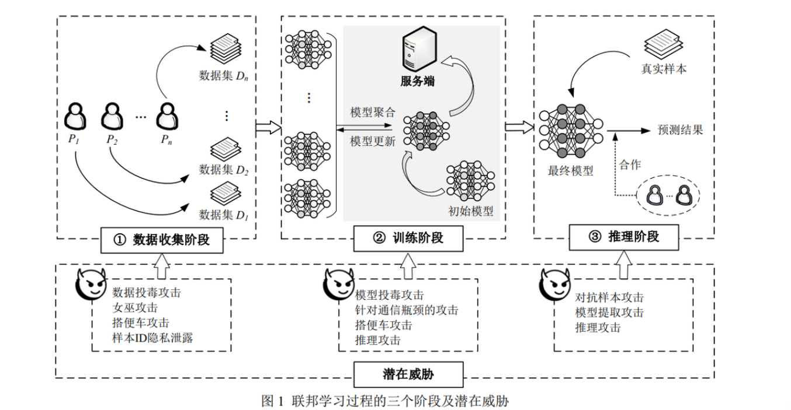
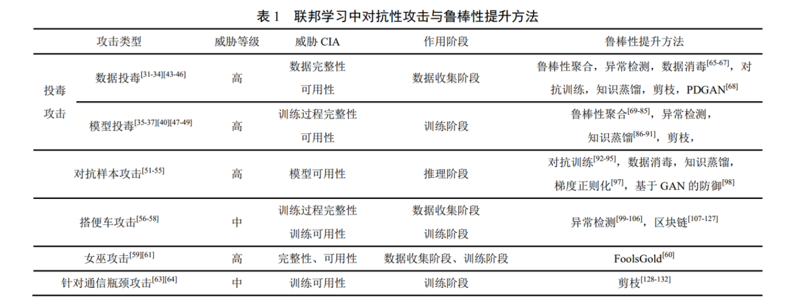
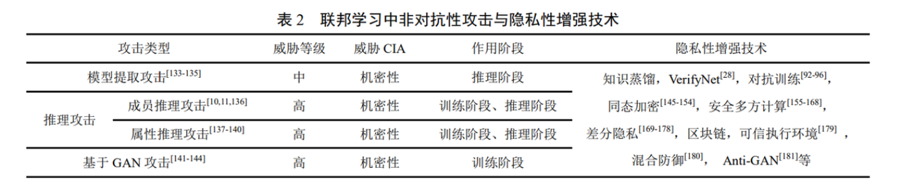
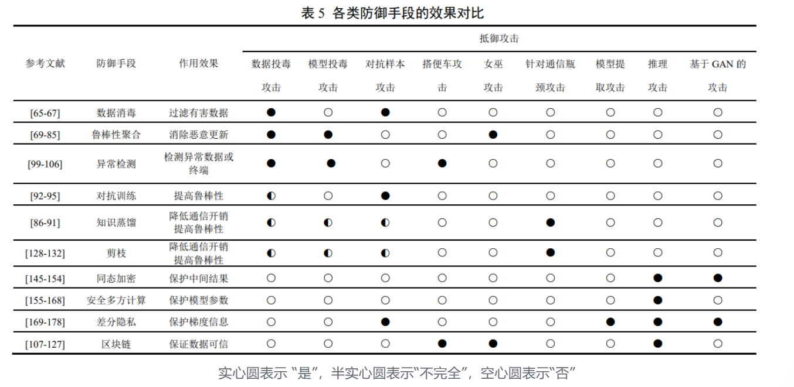
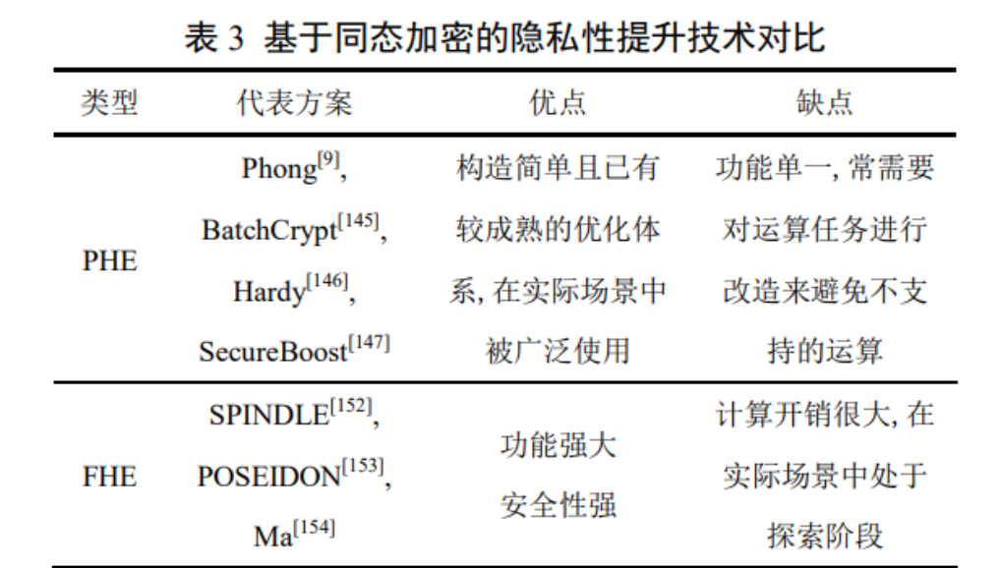
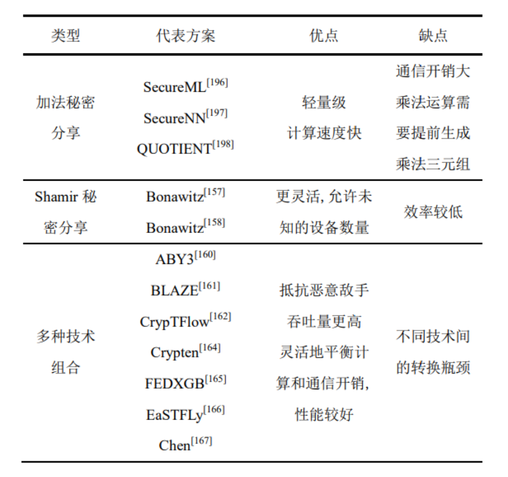

# 联邦学习系统攻击与防御技术研究综述笔记

> [!TIP]
> <strong>引言</strong>
> 联邦学习作为<strong>机器学习</strong>技术的新分支，能满足<strong>隐私数据不出本</strong>地的前提下，在多个用户之间进行高效率的联合建模、模型训练，充分释放数据潜在价值，近年来已被广泛应用于键盘预测、安全检测和信号识别等。

# 联邦学习中的潜在威胁

## <strong>联邦学习概述</strong>

联邦学习是一种以分布式方式训练模型的机器学习技术，其主要思想是确保参与方的数据保留在本地，而将训练的模型进一步上传和聚合到服务器。后续学习过程仅使用模型进行训练，保护了参与方的数据隐私，从而保护了数据安全。

### 类型

<strong>不同数据分布方式上</strong>： [什么是联邦学习（Federated Learning）？【知多少】_哔哩哔哩_bilibili](https://www.bilibili.com/video/BV1ub4y1Z7aM/?share_source=copy_web&vd_source=54b55542474b885b589dd23e8edb6b98)

- 横向联邦学习
- 纵向联邦学习
- 迁移联邦学习

<strong>依照传统机器学习过程的划分</strong>：

- 数据收集阶段：数据不会离开本地
- 训练阶段：由于数据的分布式划分以及隐私性要求，需要使用特定的模型训练算法
- 推理阶段：把训练好的模型部署在具体的应用场景中，输入真实样本进行预测的过程。由于每个用户只拥有一部分模型，推理阶段需要用户之间的合 作才能完成推理过程。

### 开源框架实现

- [TFF 框架](https://www.tensorflow.org/federated?hl=zh-cn)
- [FATE 框架](https://github.com/FederatedAI/FATE)
- [PaddleFL 框架](https://github.com/PaddlePaddle/PaddleFL/blob/master/README_cn.md)
- [PySyf 框架](https://github.com/openmined/pysyft)

### 联邦学习的安全属性

#### 联邦学习的完整性

- <strong>数据集完整性</strong>：用户的数据始终是良性的、未被篡改的
- <strong>训练过程完整性</strong>：指服务器、用户等参与方都严格地按照联邦学习协议执行算法

#### 联邦学习的可用性

- 训练可用性：是指能够在预计时间内完成模型的训练

  - 收敛性：指模型能够在经过可接受的训练轮数内达到收敛状态
  - 合作公平性：是联邦学习场景中特有的，指用户能够依据自身的贡献获得公平的补偿
- 模型可用性：指在推理阶段模型部署后的准确性和公平性

  - 公平性：指保证训练的模型不会对某些属性存在潜在的歧视性

#### 联邦学习的机密性

- 指本地数据、全局模型等敏感信息不会泄露给非授权的用户
- 保证了用户不会因为网络不稳定、设备问题被动退出工作流后，导致本地梯度的机密性泄露。

### 潜在威胁

#### 对安全属性的不同影响

- 安全威胁：会破坏联邦学习中的完整性和可用性

  - 对联邦学习造成安全威胁的攻击称为<strong>对抗性攻击</strong>，其主要目的是干扰联邦学习<strong>训练</strong>或<strong>推理</strong>过程
- 隐私威胁：胁会破坏联邦学习中的机密性

  - 对联邦学习 造成隐私威胁的攻击称为<strong>非对抗性攻击</strong>，其主要目的是试图从联邦学习各个阶段获取<strong>隐私信息</strong>或其它好处，但不会破坏模型训练和推理过程。

#### 不同阶段受到的攻击

1. 数据收集阶段

   - 安全威胁
     - 数据投毒攻击（Data Poisoning Attack）
     - 女巫攻击（Sybil Attack）
     - 搭便车攻击（Free-riding Attacks）
   - 隐私威胁
     - 包括样本 ID 隐私泄露。
2. 训练阶段

   - 安全威胁
     - 模型投毒攻击（Model Poisoning Attack）
     - 针对通信瓶颈（Communication Bottlenecks）的攻击
     - 搭便车攻击
   - 隐私威胁
     - 推理攻击
3. 推理阶段

   - 安全威胁
     - 样本攻击
   - 隐私威胁
     - 模型提取攻击（Model Extraction Attack）
     - 推理攻击

# 联邦学习中的攻击手段

## 对抗性攻击

### 投毒攻击

- 指攻击者通过控制和操纵部分训练数据或模型来破坏学习过程。

> 联邦学习中每个用户都拥有一个数据集，内部的恶意攻击者可以轻易地对数据集、训练过程和模型进行篡改，实现降低模型性能、插入后门等一系列攻击效果。

- 投毒攻击是联邦学习中应用最广泛、研究最深入的攻击。

<strong>根据攻击方式的不同：</strong>

<strong>根据攻击目标的不同：</strong>

### 对抗样本攻击

- 指在推理阶段中，刻意地给输入样本增加轻微的恶意扰动，使得分类器以极高概率对样本进行错误分类，从而导致模型输出错误的预测结果。

按照攻击者拥有的信息：

### 搭便车攻击

- 指部分用户不参与协作或者不具备足够的条件，而试图从集体性质的服务和公共产品中获得优势。
- 其主要发生在带有激励的联邦学习中，破坏训练过程完整性和合作公平性。
- 攻击者一般不消耗或只消耗部分的本地数据和计算资源， 通过向服务器发送随机更新或与聚合模型相似的更新，伪装成参与联邦学习训练的正常用户，以获得相应激励，同时可能对模型性能造成一定影响。

### 女巫攻击

- 指在允许成员自由加入和退出的系统中，单个攻击者通过多个合谋的身份加入系统，从而巧妙地分配攻击，以增强隐蔽性和攻击效果。

### 针对通信瓶颈的攻击

- 在联邦学习中，需要在大量参与设备和服务器之间来回交换更新后的梯度，频繁的通信和传输的数据量都会产生大量的通信开销；
- 其次，大量异构设备有限的网络带宽，会增加成员掉队的情况，进一步导致通信时间增长；
- 此外，攻击者可能通过破坏通信信道来影响联邦学习系统的稳定性和鲁棒性。
- 以上这些问题成为了联邦学习的主要通信瓶颈，统称为针对通信瓶颈的攻击。它影响了联邦学习的训练可用性，在 HFL 与 VFL 系统中都有可能发生。

## 非对称性攻击

### 模型提取攻击

- 指攻击者尝试反复发送数据以获取响应结果，从模型的 API 接口中恢复出原始模型参数或功能，甚至构造出与原始模型几乎等效的模型。
- 一般发生在模型推理阶段，破坏模型机密性。

### 推理攻击

- 成员推理攻击：目的是推断训练数据集中是否包含特定的个人数据记录。

  - 尝试推断某个样本点是否用于训练给定模型，是最简单的一种推理攻击。
- 属性推理攻击：目的是推断训练数据集的某些属性。

  - 指攻击者尝试推断训练数据集的特征信息，包括某个样本的具体数值或数据集的整体属性，例如年龄分布、性别分布等。

### 基于 GAN 的攻击

> - 生成对抗网络是一种很有前景的无监督深度学习模型，通过生成模型和判别模型的互相博弈产生很好的输出样本。

- 通常，基于 GAN 的攻击能够发起投毒攻击或推理攻击，它是一种威胁程度非常高的攻击方式，通常作用于模型的训练阶段。

# 联邦学习中的防御手段

## 数据消毒

- 选用数据消毒技术虽然可以过滤掉那些中毒信息，保护数据的可用性和有效性，但需要访问用户的本地数据，无法保证数据隐私性，也难以在联邦学习分布设置的服务器中实现。
- 随着数据投毒攻击的增强，数据消毒可能很难达到期望的防御效果。面对自适应投毒攻击时，数据消毒防御效果并不乐观。
- 所以数据消毒在联邦学习中较难实施。

## 鲁棒性聚合

### 基于统计特征和相似性的鲁棒性聚合

- 越离散的参数更新意味着越有可能是恶意更新。
- 因而在聚合时可以通过绕开离散的参数更新，或根据更新之间的相似性来消除远离总体分布的恶意更新，来提高针对对抗性攻击的鲁棒性。
- 其标准大多依赖于参数更新的统计特征，如中值、平均值、欧式距离等。
- 大部分聚合方案都需要已知恶意用户数量的强假设，难以在实际中应用。

### 基于局部模型性能的鲁棒性聚合

- 基于局部模型性能的鲁棒性聚合通过在服务器提供的良性辅助数据集上对每个局部模型的训练优劣进行评估，依据评估的结果来分配聚合的权重，或自动丢弃对准确性产生负面影响的更新。
- 这类鲁棒性聚合方法直接依赖数据集的测试结果，检测效果通常更加可靠。但同时也因为需要预先构建好的辅助数据集，在实际中很难应用。
- 此外，该类方法涉及了局部模型的部署推理，与联邦学习局部模型的隐私性需求相冲突。

### 基于训练函数优化的鲁棒性聚合

- 这类鲁棒性聚合方法不同于前两种方法直接对训练结果进行评估和剔除，转而利用深度学习训练过程中的损失函数、多轮训练结构特点协助进行鲁棒性聚合，契合联邦学习特点，适用于隐私保护和性能优化，但目前的研究和实验尚少。

### 总结

- 使用鲁棒性聚合减少异常的影响是联邦学习的直接改进，可以实现较好的防御效果。
- 但与联邦学习的主要思想存在一定矛盾，由于联邦学习需要利用不同用户的 NON-IID 训练数据 (包括不常见或低质量的数据) 的多样性，而放弃与全局模型不同的模型更新是与此相违背的。
- 在联邦学习种如何平衡训练效果和对恶意攻击的防御，是鲁棒性聚合研究面临的主要挑战之一。

## 异常检测

> 旨在使用统计和分析方法对模型的训练模式、数据集或相关事件进行甄别，若检测到不符合预期的模式、异常行为 或异常数据，则系统会预警并做出反应措施。

### 客户端异常检测

- 客户端由于受内部或外部因素的影响会主动或被动地偏离模型训练的原定流程，如无意的客户端缺陷，或恶意的攻击者伪装成普通客户端。客户端异常检测是一种基于某种数学算法来检测异常客户端的防御方法。

### 数据异常检测

- 在数据采样过程中产生的个别异常数据，或遭受投毒攻击后的数据集，都会降低模型的训练效果。
- 而数据异常检测则用以检测数据集中的离群点或与正常数据特征值距离较远的值。

### 对抗训练

- 对抗训练是指在模型训练的过程中加入微弱扰动，以提高系统鲁棒性的防御方式。
- 但对抗训练对于更复杂的黑盒攻击可能不具备稳定性，且加入的扰动必然会影响分类的准确度，故需要进一步采用适当的优化技术来改善这些问题。
- 此外，对抗训练本身需要大量数据集，并且增加了计算资源的消耗。尤其在具有较多参与方的跨设备式联邦学习环境中，轻量级用户可能无法负担高昂的对抗训练成本。
- 就目前而言，对抗训练主要集中于针对联邦学习环境中的对抗样本攻击进行防御，但分析发现，对抗训练也极大地减少了推理攻击带来的威胁，提高了用户数据的隐私性，对于如何利用对抗训练来抵御其他类型的攻击研究值得进一步研究。

### 知识蒸馏

- 在不同模型训练场景中，若想实现更好的预测结果，往往会选择集成许多较弱模型，但这样会导致更大的计算量和更多的资源空间占用。
- 知识蒸馏作为模型压缩技术之一，就是将大模型相关知识逐步传递到小模型中，并从大模型学到的知识中学习有用信息来指导小模型训练，使小模型具备和大模型相当的性能。
- 在需要频繁交换训练信息的联邦学习中，知识蒸馏可以有效地降低通信开销、节省存储空间和降低参数冗余，从而防御针对通信瓶颈的攻击。此外，知识蒸馏还提高了模型的泛化能力，能够一定程度上防御投毒攻击和对抗样本攻击。
- 知识蒸馏能够具有降低通信开销、提高模型鲁棒性的特点，在深度学习领域已经成为一个研究热点。
- 当其与联邦学习技术融合时，需要考虑场景的分布式等特点，包括针对投毒攻击等对抗性攻击的防御效果研究，目前仍存在一些空白。

### 剪枝

- 剪枝技术也是一种模型压缩技术，可以在用户的计算能力和通信带宽相对较低的情况下，将联邦学习模型的大小进行修剪，降低模型复杂度和提高精度。
- 此外，在联邦学习中受到投毒攻击后的模型会产生异常的神经元，而应用剪枝技术可以删除这部分异常神经元用以净化整个模型。
- 作为模型压缩技术之一，剪枝可以提升模型的泛化能力，避免过拟合现象。
- 然而，不规则的剪枝可能导致模型收敛需要更多的迭代才能完成，或导致系统参数偏差，这在特定联邦学习场景下会消耗额外的资源。
- 因此，合适的剪枝应从问题本身出发，保证不丢失正确的结果，并考虑整体效果设定一个合适的阈值，尽可能的剪去一些不必要的枝条。
- 在此基础上，还应该减少搜索的次数以提高剪枝效率，以上这些因素都是剪枝研究考虑的优化思路。

### 其他方法

> - 这些鲁棒性提升方法大多是从传统机器学习场景迁移到 HFL 中，但是在 VFL 中不一定适用，如何提升 VFL 的鲁棒性还需要进一步研究。

## 联邦学习隐私性增强技术

> - 为了应对联邦学习中的隐私威胁，在联邦学习中引入密码学相关技术是目前主流的隐私保护研究方向。

### 基于同态加密的隐私性增强

> - 是一种无需访问数据本身即可对数据进行处理的概率加密技术，即对经过同态加密的数据进行运算后再解密得到的结果与直接对明文进行运算得到的结果一致。

#### 基于半同态加密（PHE）的隐私性增强

#### 基于全同态加密（FHE）的隐私性增强

#### 总结

- 综上，基于同态加密的方案能在一定程度上防御联邦学习中存在的隐私威胁，保证中间结果的正确性，但尚处于以学术界为主的研究阶段，尚未在工业界得到大规模应用。
- 一方面，联邦学习模型训练过程需要不断迭代，本身需要大量的计算资源，而目前同态加密的计算开销也很大，这导致在实际应用中难以实施。
- 另一方面，基于 PHE 或 FHE 的隐私性增强方案会受到一 定的局限性，如精准度损失、复杂度较大和性能要求等问题。

### 基于安全多方计算的隐私性增强

> - 安全多方计算指无可信第三方参与下，多个参与方之间安全地计算一个模型或函数问题。
> - 不同于同态加密模型，SMPC 具备严格的安全定义和独到的安全优势，能为联邦学习设计个性化的安全多方计算协议，为中间参数提供计算安全性，有效提升模型参数或梯度向量的隐私性。

#### 基于加法秘密分享的隐私性增强

#### 基于 Shamir 秘密分享的隐私性增强

#### 多种技术组合的隐私性增强

#### 总结

- 综上，虽然基于安全多方计算的联邦学习隐私性增强能够保护中间参数的安全性，但几乎大部分方案都需要大量通信或计算开销，且存在效率与隐私之间的权衡问题，故需要我们进一步研究。
- 此外， 在 VFL 的数据对齐阶段，可以通过 SMPC 中的隐私集合求交协议来找出各个用户的共同样本，从而避免交集之外的样本信息被泄露。
- 在早期的隐私保护机器学习研究中已被提出。最近，VFL 方案的数据对齐阶段大都采用了这种方法，只要诚实方占大多数，就不会泄露关于交集之外的样本的任何信息。
- 但在这样的数据对齐方式中，交集样本信息被公开给了所有参与方，这在很多场景中仍会引起隐私泄露的担忧，目前对于这个问题的研究还不多。

### 基于差分隐私的隐私性增强

> - 差分隐私旨在传输的梯度信息中加入随机噪声，将其查询操作的实际结果隐藏起来或模糊化直至无法区分，从而实现对隐私数据的保护。
> - 差分隐私一般是用来促进敏感数据上的安全分析，使敌手无法在输出结果中识别个体之间的敏感性。
> - 通常，差分隐私可用于防御模型提取攻击、成员推理攻击、基于 GAN 攻击和窃听等。
> - 因此，基于差分隐私的联邦学习模型可作为保护本地训练数据私密性、梯度信息机密性和衡量隐私损失阈值的有效解决方案。

- 虽然差分隐私能为联邦学习提供强大的隐私保护能力，有效防御非对抗性攻击，提升系统的安全性。但在加入随机噪声后，训练结果的准确性难以保障，且训练出准确的模型需要较高 隐私预算，故难以量化这些方法提供的隐私保护水平，并且差分隐私对于恶意服务器模型下的主动成员推理攻击防御效果较差。
- 总体而言，相较于安全多方计算模型，基于差分隐私的联邦学习模型消耗的通信和计算开销会更低，但同时会损失训练结果的准确性，在后续研究中仍需在隐私性和准确性之间做权衡。

### 基于区块链的隐私性增强

> 以上提到的同态加密、安全多方计算和差分隐私等密码技术能够实现较好的隐私保护，但这些技术大都依赖中心化参数服务器发送的模型参数，即无法保证全局模型的可信度，且多数用户之间存在不信任等问题。
>
> - 区块链作为一种以密码学、 共识算法和分布式存储等技术相结合的去中心化存储架构，其特有的数据结构优势结合密码技术可以增强联邦学习的完整性和机密性。

#### 去中心化联邦学习通用模型设计

根据区块链的去中心化架构优势，去中心化的联邦学习通用模型设计是一个重要的研究方向。

1. 为互不信任的多方设计了一个区块链授权的安全共享体系结构，将数据共享问题转化为机器学习问题，利用差分隐私扰动本地训练的数据，并根据训练结果的质量来完成共识过程，以确保局部模型和全局模型的可信性。
2. 基于区块链的 PPFL 框架，该框架利用区块链记录模型更新流程，且无需用户的半城实假设，即可完成本地 模型更新的安全聚合。
3. 基于区块链和加密原语实现对等客户端之间隐私保护的多方联邦学习方案，该方案不依赖集中式的协调服务器，采用以每轮训练过程中达成模型状态的联邦共识机制来防止投毒攻击，以及避免了对等客户端更新时受到的隐私泄露攻击。
4. 构建一个去中心化的参数聚合链，利用区块链和差分隐私保护中间参数的可信和隐私，协作者节点进行参数验证，并提出节点贡献度证明共识算法选出主节点记账。

   - 然而，该方案仅支持防御投毒攻击，不能有效防御推理攻击，且无法保证协作者是恶意的还是半诚实的。
   - 因此，还需更多安全性假设和密码技术来保证 PPFL 的有效性。
5. 此外，中央服务器可能会因为自利性偏袒某些用户，甚至恶意中央服务器可能对模型进行投毒或收集用户的隐私信息。由于区块链上的参数信息 不能公开，往往需要与加密技术相结合或是增加细粒度访问，来对隐私数据进行有效的保护。

#### 联邦学习激励机制和智能合约研究

> - 联邦学习模型的效果取决于各个用户的数据集和贡献量，若没有足够的训练数据和其他资源， 则会导致系统性能降低。
> - 相反，若能激励用户积极参与模型训练，并结合防篡改和可信的智能合约来执行，则可进一步提高系统的鲁棒性和隐私性。

1. 同时具备身份验证和激励功能的基于区块链联邦学习系统 BlockFL。通过对局部模型参数进行交叉验证和调整区块生成率，从而提高全局模型的可信性和降低延迟时间，加强了系统的鲁棒性。
2. 可审计的联邦学习系统。该系统具备了防篡改的局部模型参数更新，诚实用户获得公平分配的收益，而恶意用户将受到惩罚。
3. 基于区块链的联邦学习安全框架，利用智能合约来抵御恶意或不可靠的用户发起的投毒攻击，并使用本地差分隐私来防止成员推理攻击。

   - 但较多的参与方和通信开销可能会影响系统效率和模型准确度。
4. 可将参与训练各方设备的信誉值上链，用以识别恶意用户或故障用户，将用户的异常行为与激励机制挂钩，规避恶意攻击者对系统的破坏，迫使用户带来积极和诚实的模型贡献。
5. 利用区块链上智能合约的公开透明性，为联邦学习中的数据贡献者建立了公平、安全的激励机制，有效地惩罚了表现不佳的用户。

#### 总结

- 以上大多数方案的目标是激励用户参与训练或实现贡献与收益的公平性，但引入区块链后也会增加一些额外的操作，例如需要对模型更新进行验证审计、共识上链和收益分配等。
- 这些额外的操作又会带来训练效率降低、通信与计算开销增大和设备规模受限等新问题，需要进一步考量和完善。

#### 联邦学习的不同应用场景研究

- 为了符合实际场景下的隐私保护需求，目前已有许多将区块链和联邦学习相结合应用在特定场景下的联邦学习隐私保护方案。

  - 利用分布式哈希表和区块链解决雾计算场景中的单点失败和计算机学报投毒攻击问题
  - 在车载机器学习场景中引入区块链与联邦学习相结合的框架完成安全的梯度聚合、无集中模型协调器的交通流预测联邦学习框架
  - 以及面向智能家居设备场景构建了一种减少恶意用户攻击行为的联邦学习隐私保护方案等。
  - 去中心化联邦学习的医疗 q 数据共享方法 Swarm Learning。该方法将横向联邦学习和许可区块链相结合，利用区块链技术安全可靠的与对等节点协作学习，以保证不同医疗机构之间医疗数据的安全性和隐私性。
- 区块链技术与联邦学习相结合的方案也会面临 51% 攻击等安全问题，且由于不同应用场景下的隐私和效率等级需求不同，相应的实施方案也会有所差异。
- 因此，针对不同应用场景的功能需求，还需继续研究在保证联邦学习过程中隐私性的同时，不会降低模型准确性或系统效率。

### 其他隐私增强技术

- 综上所述，围绕本地敏感数据、梯度向量和模型聚合结果这三个隐私保护目标，应用同态加密、 安全多方计算、差分隐私和区块链等新兴技术可解 决联邦学习中的隐私威胁和安全威胁，从而增强联邦学习隐私保护。
- 这些隐私增强技术在为联邦学习 隐私需求提供有效保障的同时，往往也会在一定程度上付出相应的代价。
- 例如，在保证隐私性的同时牺牲了系统的效率，或是降低了模型的准确性。相反，若是提高了系统性能和准确性，相应地通信和计算开销又会增大。
- 因此，在隐私性、高效性和准确性不可能三角之间做权衡，是联邦学习技术发展的未来研究重点。

# 未来研究方向

## 攻击检测与模型评估研究

- 联邦学习的迅速发展势必会带来多样化形式的安全与隐私威胁。数据用户可能会主动或被动的从诚实状态转变为恶意状态，模型训练过程中操作处理也可能会受环境因素发生异常，这些问题往往会严重影响系统性能。
- 事实上，若系统能及时且有效地发现这些行为、提供预警功能，以及主动采取反应措施能最大程度降低危害和损失。
- 因此，如何 建立安全稳定的攻击检测与评估模型，为联邦学习 系统赋予自检与评估能力，为内部和外部环境提供 实时防护功能，未来需要进一步探索研究。

## 完善的安全攻防体系研究

- 由于现有的联邦学习协议还未发展成熟，相应的体系还不够完善，仅仅依靠现有的防御手段无法预防未来未知的攻击威胁。
- 若系统面对一种全新或特殊的攻击威胁，没有提前预备方案，即无法满足已成型的技术产品安全需求；同时，若系统面对混合多种攻击的安全威胁，仅依靠传统的单一解决方 案，也很难达到有效的防御效果。
- 然而，目前的研究工作尚未对联邦学习中攻击与防御技术形成系统化的攻防体系。
- 因此，未来应从现有的攻击方式 和防御手段出发，分析推理出所有可能潜在的攻击和隐私问题，并结合安全的加密技术，以此构建出完善的联邦学习安全攻防体系。

## 纵向联邦学习安全及隐私研究

- 现有的联邦学习安全及隐私的研究，尤其在安全威胁及防御方面，主要集中在横向联邦学习场景下，而在纵向联邦学习场景中模型训练与部署更加复杂，相关的研究还非常少。如模型在用户之间的切分导致一些攻击方案和防御手段在纵向联邦学习中并不适用。
- 与此同时，也有一些纵向联邦学习特有的安全和隐私威胁，例如标签推理攻击、来自内部的模型窃取攻击，以及样本 ID 隐私泄露问题等。
- 这些纵向联邦学习中特有的攻击及防御手段仍然需要深入研究，以便解决纵向联邦学习在真实场景中实际应用的瓶颈问题。

## 兼顾鲁棒性和隐私性的联邦学习研究

- 鲁棒性与隐私性是联邦学习系统在实际应用中需要考虑的两个维度指标，两者缺一不可。
- 然而鲁棒性提升与隐私性增强之间存在矛盾，例如很多隐私保护手段试图尽量减少不同用户梯度信息的差异，而这常常会阻碍一些鲁棒性提升方法对异常数据的识别。
- 因此，如何处理这个矛盾是联邦学习在大规模应用之前面临的重要问题。

# 结论

- 联邦学习解决了不同训练用户之间的数据孤岛问题，打破了不同领域之间的数据壁垒，但其无法避免在模型训练与参数传递时遭受各种攻击威胁。
- 攻击和防御相互促进，强大的攻击手段会催生出针对性的防御技术，而稳固的防御技术又会促进攻击手段的提升。
